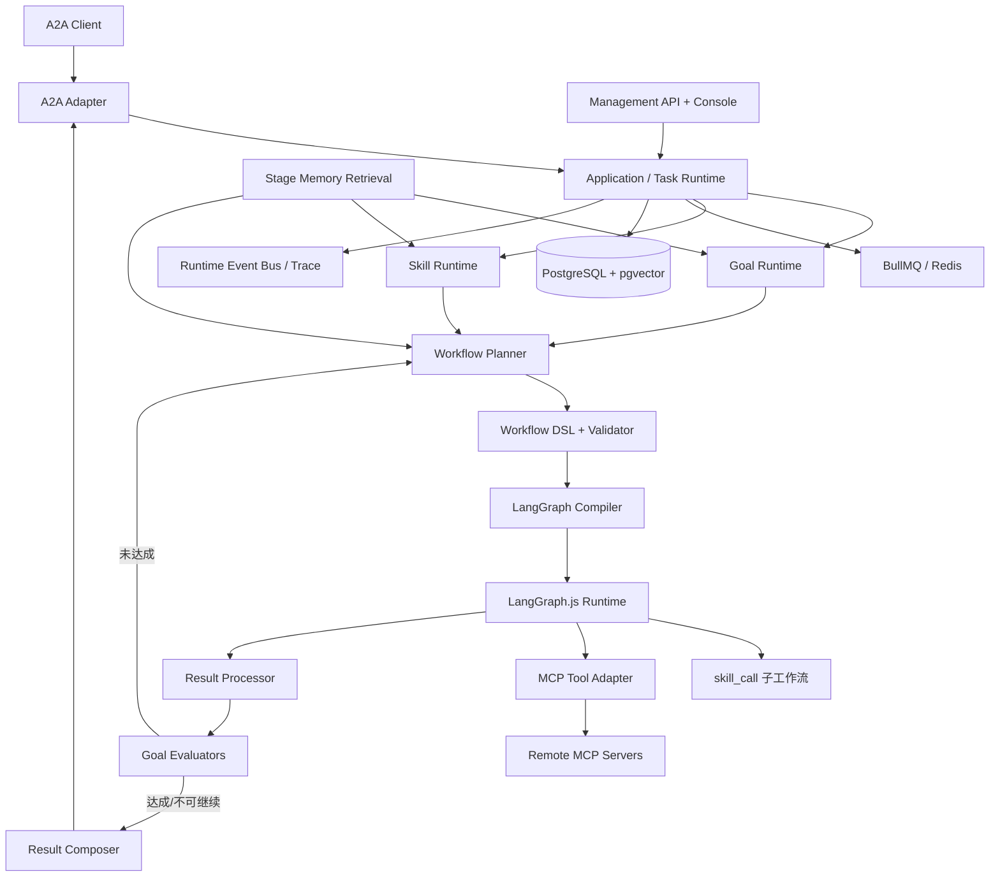

# 总体架构基线

## 逻辑架构



## 模块边界

| 模块 | 权威职责 | 禁止承担 |
|---|---|---|
| A2A Adapter | 协议对象、状态映射、流式事件、Agent Card | Goal/Skill/Workflow 业务逻辑 |
| Task Runtime | 任务队列、会话串行、生命周期编排 | 直接理解 MCP Schema |
| Goal Runtime | Goal 识别、版本、Patch、达成闭环 | 图节点调度 |
| Skill Runtime | Skill 注册、版本、检索、组合、工具边界 | MCP 网络调用 |
| Workflow Planner | 根据 Goal/Skill/记忆生成 DSL | 执行任意代码 |
| DSL Validator | 结构、引用、Schema、预算、循环安全 | 业务推理 |
| LangGraph Compiler | 把合法 DSL 编译为 StateGraph | 决定 Goal 是否达成 |
| MCP Adapter | Tool 发现、Schema、调用、结果封装 | Skill 选择 |
| Result Processor | 标准化、摘要、事实提取、记忆候选 | 直接发布 Skill |
| Evaluation/Evolution | 多评估器、经验聚类、Skill 模拟验证 | 绕过发布/版本规则 |
| Console | 管理和可视化真实运行数据 | 自建另一套执行状态 |

## 运行时主循环

```text
A2A Message
→ Context/Goal Load
→ Goal Resolve/Patch
→ Stage Memory Retrieval
→ Skill Match/Compose
→ Workflow DSL Plan
→ Validate/Auto-fix
→ Plan Confirmation
→ Compile and Execute LangGraph
→ Normalize Results
→ Goal Evaluation
→ Replan or Final Result
→ Experience/Evaluation/Memory
```

## 技术建议

- 后端：Node.js 当前兼容的 Active LTS、TypeScript strict、Express（优先兼容官方 A2A SDK）。
- 数据：PostgreSQL、pgvector、Redis、BullMQ、Drizzle ORM（最终由兼容性 Spike 确认）。
- Schema：JSON Schema 2020-12 + Ajv；领域内部可配合 Zod。
- 前端：React、Vite、TypeScript、React Flow、TanStack Query。
- 可观测：OpenTelemetry 语义，首版本地 Trace 存储和控制台展示。
