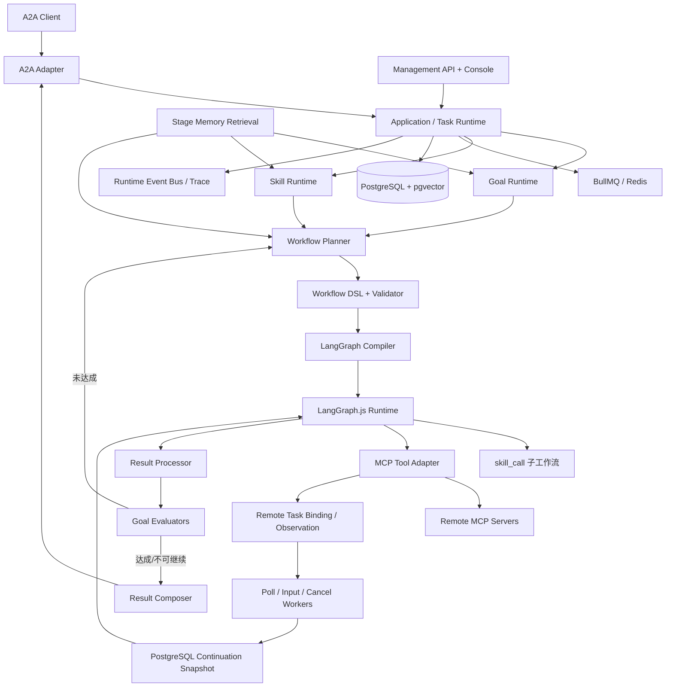

# 总体架构基线

## 逻辑架构



## 模块边界

| 模块                 | 权威职责                                                    | 禁止承担                                   |
| -------------------- | ----------------------------------------------------------- | ------------------------------------------ |
| A2A Adapter          | 协议对象、状态映射、流式事件、Agent Card                    | Goal/Skill/Workflow 业务逻辑               |
| Task Runtime         | 任务队列、会话串行、本地与远程生命周期编排                  | 直接理解 MCP Schema 或伪造 Provider 状态   |
| Goal Runtime         | Goal 识别、版本、Patch、达成闭环                            | 图节点调度                                 |
| Skill Runtime        | Skill 注册、版本、检索、组合、工具边界                      | MCP 网络调用                               |
| Workflow Planner     | 根据 Goal/Skill/记忆生成 DSL                                | 执行任意代码                               |
| DSL Validator        | 结构、引用、Schema、预算、循环安全                          | 业务推理                                   |
| LangGraph Compiler   | 把合法 DSL 编译为 StateGraph                                | 决定 Goal 是否达成                         |
| MCP Adapter          | Tool/Task 发现、协议协商、Schema、调用、结果封装与 SDK 隔离 | Skill 选择、本地 Binding/continuation 权威 |
| Remote Task Services | Binding、版本化轮询、输入/取消投递、continuation 控制       | 执行另一套图、恢复普通 running Workflow    |
| Result Processor     | 标准化、摘要、事实提取、记忆候选                            | 直接发布 Skill                             |
| Evaluation/Evolution | 多评估器、经验聚类、Skill 模拟验证                          | 绕过发布/版本规则                          |
| Console              | 管理和可视化真实运行数据                                    | 自建另一套执行状态                         |

## 运行时主循环

```text
A2A Message
→ Context/Goal Load
→ Goal Resolve/Patch
→ Stage Memory Retrieval
→ Skill Match/Compose
→ Workflow DSL Plan
→ Validate/Auto-fix
→ Plan Confirmation
→ Compile and Execute LangGraph
→ Normalize Results
→ Goal Evaluation
→ Replan or Final Result
→ Experience/Evaluation/Memory
```

## 技术建议

- 后端：Node.js 当前兼容的 Active LTS、TypeScript strict、Express（优先兼容官方 A2A SDK）。
- 数据：PostgreSQL、pgvector、Redis、BullMQ、Drizzle ORM（最终由兼容性 Spike 确认）。
- Schema：JSON Schema 2020-12 + Ajv；领域内部可配合 Zod。
- 前端：React、Vite、TypeScript、React Flow、TanStack Query。
- 可观测：OpenTelemetry 语义，首版本地 Trace 存储和控制台展示。

## v1.1 MCP Tasks 增量

Phase 6 保持现有模块边界：`mcp_tool` 仍由唯一 LangGraph.js Runtime 执行；Domain 定义 task execution、availability、readiness、risk、Binding、continuation、输入和取消状态；Application 批量检查并执行确定性 Guard，再通过持久 control 把远程结果送入新的 LangGraph continuation invocation；MCP Adapter 独占 wire/SDK 映射；PostgreSQL 追加保存 planning/pre-invocation、Binding、观察、控制、输入、取消和 continuation 证据；Redis/BullMQ 只保存可重建的一次投递引用。

若 Tool 注册语义为 `task_required`，即使模型生成的 `mcp_tool` 未显式携带 `taskExecution`，规划与执行边界也会隐式采用 `require_task + availabilityCheck=required`。执行前仍必须以已解析、冻结的真实参数运行 readiness Guard，模型不能通过省略 DSL 字段绕过检查。

远程 handle 结束当前图调用，并把实例投影为 `waiting_external`；`node_waiting_external` 是持久节点事件，不是成功事件，也不能满足并行 Join。仅当 V1.1 组合选项显式启用且 PostgreSQL 中存在相互匹配的 active snapshot、waiting binding、`waiting_external` instance 和可轮询 Binding 时，启动恢复才保留该等待并重建队列。所有普通 `running`/`paused`/`evaluating` 工作仍以 `PROCESS_EXECUTION_LOST` 失败且不自动重试。

Management API/Console 是 PostgreSQL 权威证据的清洗投影，提供按 Task 关联的 capability、availability、Binding、观察、控制、continuation、输入、取消和最终结果，以及版本 CAS refresh、幂等 cooperative cancel 和既有 Task input action。它不成为第二状态源。Provider 对资源接纳、预约、业务 Timer 和远程终态权威；SDAR 不申请锁、不暂停远程 Task，也不伪造 Provider 终态。

## v1.2.3 Cognitive planning and Experience increment

V1.2.3 adds a cognitive Domain/Application slice but no second Agent, Workflow, Memory or model runtime.
The online cognitive path produces only immutable Understanding, Goal Contract and Plan candidates;
only confirmed Contract/Plan data crosses into the existing v1.2.2 planner/controller authority.
`UserGoalPlanController` remains the sole User Goal/A2A terminal writer, and LangGraph.js remains the
only executable workflow graph.

The offline path begins with a PostgreSQL transactional outbox committed with v1.2.2 runtime facts.
Episode/Observation/Reflection and three separate knowledge targets are asynchronous. Redis/BullMQ is
rebuildable scheduling state. Candidate knowledge is excluded from formal planning, MemoryService is an
active-only search projection, and Experience failure falls back to the base planner.

Capability Summary/Card are activated hash-matched snapshots; Summary is deterministic and excludes
current readiness, while optional narrative is display-only. Interactive sessions use immutable
revisions, expected-version CAS and idempotency keys. The detailed authority, states and KD register are
frozen by `docs/27_V1_2_3_COGNITIVE_RUNTIME_DESIGN.md` and ADR-111–114.

## v1.2 Skill-driven capability usage increment

V1.2 extends the existing Skill Registry, Selection, Skill Graph, Workflow Planner/Validator and single
LangGraph runtime. An immutable exact-version `SkillUsageSpecification` separates normative policy from
adaptive guidance and observed evidence. Package files are validated import artifacts; PostgreSQL
`skill_version` rows remain runtime authority. No package Markdown, model output or procedure artifact
is executable source.

Selection resolves applicability, authoritative context, execution mode, exact Task operations and
live V1.1 Provider readiness before planning. Bounded composition uses the existing Skill Graph, a
default depth of three and hard maximum of five. Native child policies form an exact recursive
allowlist. Legacy Usage projections retain the existing graph/capability-gap authority so older Skills
continue to run without granting native-package authority.

Guidance is structured planning data; template and procedure IR compile deterministically into the
existing Workflow DSL. Every plan passes the existing Validator plus Skill Usage compliance and the
existing outer confirmation boundary. Remote waits, input, cancel, reconcile and restart reuse V1.1
Binding/continuation authority. Append-only `SkillExecutionRecord` rows expose exact parent/child,
Provider, evidence and degraded-outcome projections without becoming a second Task, Workflow or
Provider lifecycle.

## v1.4.1 Canonical Evidence Export addendum

`sdar.evidence/v1` is the sole external Evidence output. Runtime PostgreSQL owns canonical Outbox,
cursor, ACK, DLQ, Manifest and recovery state; Control PostgreSQL owns Node governance facts. Redis
is wake/scheduling state only, and the HTTP receiver cannot mutate business authority. All 100
record types use durable source projection with stable source/schema identity and canonical hashes.
The single Runtime gives foreground Tasks priority while projection and export retain independent,
bounded five-second fairness. No ClickHouse, second Workflow runtime or cross-database transaction is
introduced; the ClickHouse directory is a future-adapter handoff only.
