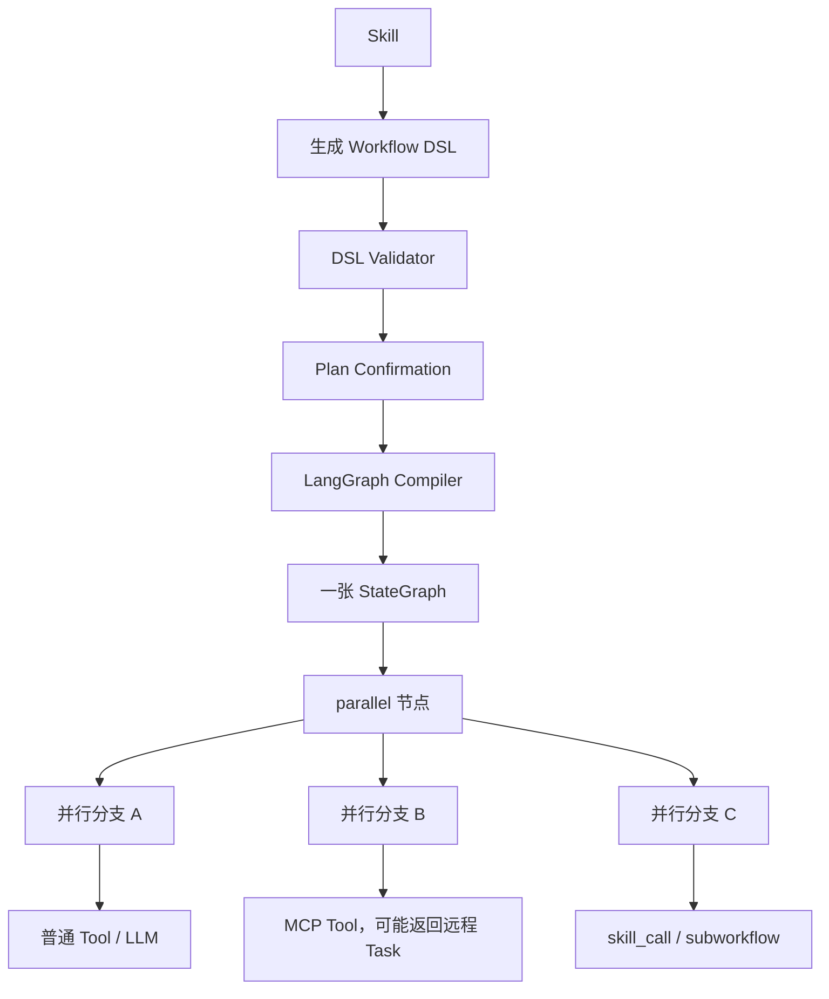
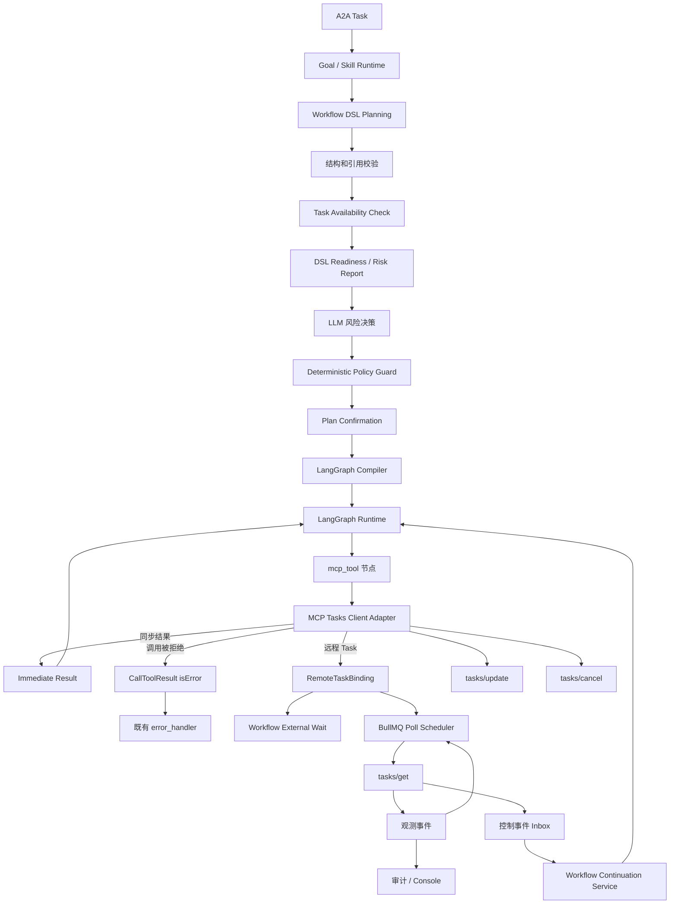

# SDAR v1.1 MCP Tasks 客户端升级设计

> **文档状态：** 最终设计冻结稿  
> **目标版本：** SDAR v1.1.0  
> **日期：** 2026-07-16  
> **适用仓库：** `zhouwen-giser/skill-driven-agent-runtime`  
> **并行开发基线：** `release/v1.0-hardening` 已完成 `v1.0.4-bug-fixed`，后续加固仍在推进  
> **配套执行文档：** `SDAR v1.1 MCP Tasks Codex 并行升级任务包`

---

# 1. 文档目的

本文档冻结 SDAR v1.1 对 MCP Tasks 的最终升级设计，解决以下问题：

1. 在不重构现有 Skill、Workflow DSL 和 LangGraph Runtime 的情况下接入远程 MCP Task；
2. 明确现有 DSL、并行分支、子 Workflow 和远程 Task 的真实运行关系；
3. 明确 Task 操作接口的 `available / restricted / disabled / unknown` 可用性语义；
4. 在 DSL 校验阶段获取受限 Task 的可用时间窗口，使 LLM 可以做出继续、改期、替换或放弃决策；
5. 明确受限 Task 在实际调用时由 MCP Provider 自行进行资源仲裁；
6. 明确远程 Task 的预约、暂停、恢复、最大等待和强制结束语义；
7. 明确远程 Task 创建后 Workflow 如何可靠进入外部等待，以及终态事件如何继续原执行分支；
8. 明确 SDAR 与 MCP Provider 的权威边界；
9. 明确 v1.1 的数据模型、协议扩展、运行流程、可靠轮询、异常映射和验收标准。

本文档的核心结论是：

> **SDAR v1.0 的总体架构方向正确，不需要大改。v1.1 在现有 `Skill → Workflow DSL → LangGraph.js` 链路上，为 `mcp_tool` 节点增加远程 Task 返回、外部等待、可靠轮询和事件继续执行能力。资源状态、Task 实际执行态、预约调度、资源抢占、暂停恢复和最大等待时间均由 MCP Provider 负责。**

---

# 2. 当前架构事实

## 2.1 Skill、DSL 与 LangGraph 的真实关系

现有 SDAR 的正确关系是：

```text
Skill
  → 生成一份 Workflow DSL
  → DSL 经过校验和确认
  → 整份 DSL 编译为一张 LangGraph.js StateGraph
  → DSL 的 parallel 节点在同一张图中形成多个并行分支
```

不是：

```text
Skill
  ├─ 独立 LangGraph A
  ├─ 独立 LangGraph B
  └─ 独立 LangGraph C
```

现有运行模型应保持：



## 2.2 `skill_call` 和 `subworkflow`

普通 `skill_call` 或 `subworkflow` 是当前分支上的调用—返回关系：

```text
父图当前分支
  → 调用子 Skill / 子 Workflow
  → 当前分支等待子图完成
  → 子图返回结果
  → 父分支继续
```

如果多个 `skill_call` 位于 `parallel` 的不同分支中，则这些子 Workflow 可以并行运行；父图在汇聚条件满足后继续。

## 2.3 v1.1 不引入第二套运行模型

v1.1 明确不引入：

- 行为树 Runtime；
- 第二套 Workflow Runtime；
- 独立的“多图调度器”；
- Skill 静态资源互斥矩阵；
- 通用资源—类型—能力本体；
- 设备资源锁；
- SDAR 内部的物理资源仲裁器；
- LangGraph 结构运行时变更。

LangGraph.js 仍是唯一 Workflow 执行 Runtime。

---

# 3. 设计目标与非目标

## 3.1 目标

v1.1 必须实现：

- MCP Tool 调用返回同步结果或远程 Task；
- 远程 Task Binding 持久化；
- `tasks/get` 可靠轮询；
- `tasks/update`；
- `tasks/cancel`；
- 进程重启后重新获取远程 Task 状态；
- Task 操作可用性查询；
- `restricted` Task 可用时间窗口；
- DSL 风险报告；
- LLM 改期、继续、替换、确认或放弃；
- Task 节点进入外部等待；
- 同一 `parallel` 下其他分支继续执行；
- Task 控制事件幂等继续原执行分支；
- 调用拒绝、启动窗口错过、最大等待到达的结构化异常处理；
- Simulation / Historical Replay execution context 传播；
- 管理 API、Console、审计和追踪。

## 3.2 非目标

v1.1 不实现：

- 通用 MCP Tasks Server；
- MCP Provider 内部任务调度；
- 跨 Provider 资源冲突；
- 设备控制权管理；
- Provider 内部暂停/恢复算法；
- 资源释放判定；
- Task 业务最大等待 Timer；
- 远程 Task 的实际执行恢复；
- A2A Task 的整体自动重放；
- 已完成副作用节点的自动重试；
- MCP Tasks 标准之外的通用能力本体；
- 用 LLM 推断物理资源冲突。

---

# 4. 核心术语

## 4.1 MCP Tool Operation

MCP Server 通过 `tools/list` 暴露的一个可调用操作。

同一个操作可以：

- 只支持同步返回；
- 可能返回远程 Task；
- 必须返回远程 Task。

## 4.2 MCP Task

某次 `tools/call` 的异步执行实例。

Task 不是新的业务能力分类。它继承原 Tool Operation 的业务语义。

## 4.3 Task Operation Availability

Provider 对“某个操作在给定参数和计划时间下是否适合调用”的动态判断。

```ts
type TaskOperationAvailability =
  | "available"
  | "restricted"
  | "disabled"
  | "unknown";
```

## 4.4 RemoteTaskBinding

SDAR 保存的远程 Task 引用，用于关联：

- MCP Provider；
- remoteTaskId；
- A2A Task；
- Workflow Plan；
- Workflow Instance；
- Workflow 节点执行；
- execution mode；
- 轮询状态；
- 控制事件；
- 最终结果。

## 4.5 观测事件

不会改变本地 Workflow 控制流的事件：

```text
task.accepted
task.scheduled
task.started
task.paused
task.resumed
task.progress
task.heartbeat
```

## 4.6 控制事件

需要重新进入 Workflow 执行语义的事件：

```text
task.input_required
task.completed
task.failed
task.cancelled
```

---

# 5. 总体架构



---

# 6. MCP Provider 权威边界

## 6.1 Provider 负责

MCP Provider 是以下信息的唯一权威：

- 真实资源状态；
- 当前操作是否可执行；
- 操作是否 `available / restricted / disabled`；
- 受限操作的可用时间窗口；
- 是否需要抢占已有 Task；
- 需要暂停哪些已有 Task；
- 新受限 Task 是否接受或拒绝；
- Task 实际排队、预约、启动、运行、暂停、恢复；
- Task 最大等待时间；
- 底层执行是否已经停止；
- 资源是否真正释放；
- Task 最终业务结果。

## 6.2 SDAR 负责

SDAR 负责：

- Skill 选择；
- DSL 生成；
- DSL 校验；
- Task 可用性查询；
- 风险报告；
- LLM 风险决策；
- Plan Confirmation；
- LangGraph 编译与执行；
- MCP Tasks Client；
- RemoteTaskBinding；
- 可靠轮询；
- Task 控制事件；
- Workflow 外部等待和继续执行；
- error_handler；
- A2A 状态和最终结果；
- 审计、Console 和追踪。

## 6.3 SDAR 不复制 Provider 状态

SDAR 可以保存 Provider 返回的状态快照用于：

- 解释；
- 审计；
- 风险展示；
- 轮询；
- 事件去重。

但这些快照不是资源和执行态的权威来源。

---

# 7. MCP Tasks 与 SDAR Provider 扩展

## 7.1 标准 MCP Tasks 能力

MCP Tasks 客户端负责：

```text
tools/call
tasks/get
tasks/update
tasks/cancel
```

SDAR 必须将当前实验性线协议隔离在 `mcp-adapter` 内，并固定使用的 Schema revision。

官方 SDK 类型不得进入 domain/application 层。

## 7.2 SDAR Task Execution 扩展

MCP Tasks 标准本身不定义：

- 操作可用性；
- 受限状态；
- 可用时间窗口；
- 预约合同；
- 最大等待；
- 暂停/恢复观测；
- 资源抢占。

因此定义 namespaced 扩展：

```text
io.sdar/taskExecution
```

建议包含三部分：

1. Tool 发现元数据；
2. Task Availability 查询；
3. Task 调用和观测元数据。

## 7.3 Tool 发现元数据

```json
{
  "name": "vehicle_patrol",
  "_meta": {
    "io.sdar/taskExecution": {
      "execution": "task_required",
      "availability": "dynamic",
      "supportsScheduling": true,
      "supportsMaxElapsed": true,
      "supportsObservations": true,
      "supportsCancel": true
    }
  }
}
```

建议内部模型：

```ts
interface McpTaskExecutionSemantics {
  execution:
    | "synchronous"
    | "task_capable"
    | "task_required"
    | "unknown";

  availability:
    | "not_supported"
    | "dynamic";

  supportsScheduling: boolean;
  supportsMaxElapsed: boolean;
  supportsObservations: boolean;

  cancellation:
    | "unsupported"
    | "cooperative"
    | "task_cancel"
    | "unknown";
}
```

v1.1 在最终合并时应复用 v1.0.11 的 MCP Tool execution semantics，不重复建立一套通用元数据。

---

# 8. Task 操作可用性与时间窗口

## 8.1 检查对象

Availability 不是静态 Tool 属性，而是以下组合的动态结果：

```text
Provider
+ Operation
+ 实际或部分参数
+ 计划启动方式
+ 计划启动时间
+ 最大等待合同
```

## 8.2 请求模型

```ts
interface TaskAvailabilityCheckRequest {
  nodeId: string;
  providerId: string;
  operationName: string;

  arguments:
    | Readonly<Record<string, unknown>>
    | {
        unresolved: true;
        knownArguments: Readonly<Record<string, unknown>>;
        unresolvedPaths: readonly string[];
      };

  timing?: TaskExecutionTiming;
}
```

如果 DSL 参数仍引用前序节点输出，计划阶段无法解析完整参数，则：

- 发送部分参数检查，或
- 将结果标记为 `unknown`；
- 节点执行前必须使用完整参数再次检查。

## 8.3 响应模型

```ts
interface TaskAvailableWindow {
  startTime: string;
  endTime: string;
}

interface TaskAvailabilityCheckResult {
  nodeId: string;
  providerId: string;
  operationName: string;

  availability:
    | "available"
    | "restricted"
    | "disabled"
    | "unknown";

  riskLevel:
    | "low"
    | "medium"
    | "high"
    | "critical";

  reasonCode?: string;
  description?: string;

  validUntil?: string;

  earliestStartTime?: string;
  nextAvailableWindows?: readonly TaskAvailableWindow[];
  estimatedDelayMs?: number;

  reservationMode:
    | "none"
    | "best_effort"
    | "guaranteed";

  reservationRef?: string;

  possibleEffects: readonly (
    | "task_preemption"
    | "task_pause"
    | "start_rejection"
    | "start_window_missed"
    | "deadline_reached"
    | "partial_completion"
  )[];
}
```

## 8.4 restricted 的时间要求

Provider 返回 `restricted` 时，应尽可能同时提供：

- `earliestStartTime`；或
- 一个或多个 `nextAvailableWindows`；
- `validUntil`；
- `reservationMode`。

这样 LLM 可以做出：

- 立即尝试；
- 修改预约时间；
- 选择一个可用窗口；
- 更换 Provider 或 Operation；
- 请求确认；
- 放弃该节点。

## 8.5 预测与预约必须区分

```text
reservationMode = none
```

只表示当前状态提示。

```text
reservationMode = best_effort
```

表示 Provider 预测该时间可能可用，但不保证。

```text
reservationMode = guaranteed
```

表示 Provider 已承诺执行窗口，必须返回 `reservationRef`。

没有 `reservationRef` 的结果不能展示为“已预约”。

---

# 9. Task 时间契约

## 9.1 数据结构

```ts
interface TaskExecutionTiming {
  start:
    | {
        mode: "immediate";
        startToleranceMs: number;
      }
    | {
        mode: "scheduled";
        scheduledAt: string;
        startToleranceMs: number;
      };

  /**
   * null 或未声明表示无期限。
   * 有值表示最大墙钟等待时间。
   */
  maxElapsedMs: number | null;
}
```

## 9.2 immediate

```text
start.mode = immediate
```

Provider 应在接收调用后的启动容差内启动。

如果 Provider 在调用时已经确定不能执行：

```text
tools/call
  → CallToolResult.isError = true
  → 不创建 remoteTaskId
```

如果 Provider 已经创建 Task，但最终未能在启动容差内启动：

```text
Task status = completed
result.isError = true
outcome = start_window_missed
```

## 9.3 scheduled

```text
start.mode = scheduled
scheduledAt = 预约启动时间
```

Provider 在调用时创建远程 Task。

在 `scheduledAt` 之前：

```text
MCP status = working
Provider observation = scheduled
```

启动截止时间：

```text
latestStartAt = scheduledAt + startToleranceMs
```

到达 `latestStartAt` 仍不能启动时：

```text
MCP status = completed
result.isError = true
outcome = start_window_missed
```

## 9.4 maxElapsedMs

最大等待是 Provider 负责的墙钟期限。

时间锚点：

- immediate：Provider 接收并接受 Task 的时间；
- scheduled：`scheduledAt`。

```text
deadlineAt = anchorAt + maxElapsedMs
```

计时包含：

```text
scheduled
queued
running
paused
resuming
```

不声明时表示无期限。

## 9.5 达到最大等待时间

Provider 必须：

1. 停止、撤销或隔离底层执行；
2. 确保不会继续产生副作用；
3. 释放资源；
4. 形成最终 Tool Result；
5. 将 Task 置为 `completed`。

返回：

```json
{
  "status": "completed",
  "result": {
    "isError": true,
    "structuredContent": {
      "outcome": "deadline_reached",
      "reasonCode": "MAX_ELAPSED_TIME_REACHED",
      "retryable": true
    }
  }
}
```

SDAR 不启动该业务 Timer，也不自行生成 `deadline_reached`。

## 9.6 `ttlMs` 不承担业务时间语义

MCP Task 对象的 TTL、保存周期或清理周期不得用来表达：

- scheduledAt；
- startTolerance；
- maxElapsed；
- deadlineAt。

---

# 10. DSL 设计

## 10.1 默认不新增 `mcp_task` 节点

Task 是 `mcp_tool` 调用的一种异步返回。

v1.1 默认扩展现有节点：

```ts
interface McpTaskExecutionSpec {
  mode:
    | "allow_task"
    | "require_task";

  timing?: {
    start:
      | {
          mode: "immediate";
          startToleranceMs: number;
        }
      | {
          mode: "scheduled";
          scheduledAt: WorkflowBoundValue;
          startToleranceMs: number;
        };

    maxElapsedMs?: number | null;
  };

  availabilityCheck?:
    | "required"
    | "best_effort";
}

interface McpToolWorkflowNode {
  type: "mcp_tool";
  tool: ToolReference;
  arguments: WorkflowBoundValue;
  taskExecution?: McpTaskExecutionSpec;
}
```

## 10.2 兼容规则

- 不声明 `taskExecution` 时，同步 Tool 行为不变；
- Provider 合法返回 Task 时，客户端仍可兼容处理；
- `allow_task` 接受同步或 Task 返回；
- `require_task` 要求 Task 返回；
- `require_task` 收到同步结果时产生稳定契约错误；
- Provider 不支持 Tasks 时，不允许 `require_task`；
- 预约时间可以使用既有 `WorkflowBoundValue`；
- 执行时解析后重新进行 Schema 和时间校验。

## 10.3 DSL 校验层次

### 第一层：结构校验

- JSON Schema；
- 节点和边；
- Tool 注册；
- Skill Policy；
- timing 格式；
- 最大值和边界；
- 动态引用合法性。

### 第二层：Provider Readiness

- 操作状态；
- 参数相关风险；
- 启动时间；
- 可用窗口；
- reservation；
- 可能影响。

### 第三层：LLM 风险决策

LLM 输出结构化决策：

```ts
type DslRiskDecision =
  | {
      action: "proceed";
      acceptedRiskNodeIds: readonly string[];
    }
  | {
      action: "reschedule";
      nodeId: string;
      selectedStartTime: string;
      reason: string;
    }
  | {
      action: "revise_dsl";
      reason: string;
    }
  | {
      action: "request_confirmation";
      riskNodeIds: readonly string[];
    }
  | {
      action: "abort";
      reason: string;
    };
```

### 第四层：确定性 Guard

LLM 不能覆盖：

- disabled；
- 非法时间；
- Schema 错误；
- 未注册 Provider；
- 权限拒绝；
- 安全硬门槛；
- 无效 reservationRef；
- 超出系统预算；
- Skill Tool Policy。

---

# 11. 节点执行前复查

DSL Readiness 是计划风险检查，不是资源锁。

节点真正执行前，使用已解析的最终参数和 timing 再次查询。

```text
mcp_tool 节点 Ready
  → 解析 arguments 和 timing
  → 原始 Tool Schema 校验
  → 刷新 Operation Availability
```

处理：

| 状态 | 运行时行为 |
|---|---|
| `available` | 调用 `tools/call` |
| `restricted` | 允许调用，由 Provider 最终仲裁 |
| `disabled` | 不调用，产生节点异常 |
| `unknown` | 按保守策略进入风险/异常判断，默认不伪造 available |

Provider 在实际调用时拥有最终决定权。

---

# 12. 受限 Task 的执行语义

## 12.1 Provider 接受

```text
Graph A 调用 restricted Task-A
  → Provider 检查实时资源
  → Provider 允许 Task-A
  → Provider 可以暂停其管理的 Task-B
  → Provider 创建 Task-A
  → 返回 remoteTaskId
```

结果：

```text
Graph A
  → Task-A
  → waiting_remote_task

Graph B
  → 原本已经等待 Task-B
  → Task-B 被 Provider 暂停
  → Graph B 仍然 waiting_remote_task
```

Provider 暂停 Task-B 不会再次挂起 Graph B，因为 Graph B 在创建 Task-B 时已经处于远程等待。

## 12.2 Provider 拒绝

```text
Graph A 调用 restricted Task-A
  → Provider 判断不能执行
  → 不创建 Task
  → 返回 CallToolResult.isError=true
```

结果：

```text
mcp_tool 节点提前异常
  → 不创建 RemoteTaskBinding
  → 进入既有 error_handler
  → LLM 在预先允许的恢复选项中选择
```

## 12.3 SDAR 不参与 Provider 抢占

SDAR 不需要：

- 请求暂停其他 Graph；
- 选择旧 Task；
- 提交抢占计划；
- 判断资源释放；
- 恢复旧 Task。

Provider 对旧 Task 的暂停、恢复和最终处理全部是 Provider 内部调度行为。

---

# 13. Task 状态、子状态与观测

## 13.1 MCP Task 协议状态

```ts
type McpTaskStatus =
  | "working"
  | "input_required"
  | "completed"
  | "failed"
  | "cancelled";
```

## 13.2 Provider 子状态

```ts
type ProviderTaskSubstate =
  | "scheduled"
  | "queued"
  | "running"
  | "paused"
  | "resuming"
  | "stopping";
```

子状态通过 namespaced `_meta` 返回。

示例：

```json
{
  "taskId": "task-b",
  "status": "working",
  "_meta": {
    "io.sdar/taskExecution": {
      "observationRevision": "18",
      "substate": "paused",
      "reasonCode": "PREEMPTED_BY_RESTRICTED_TASK",
      "observedAt": "2026-07-16T10:05:00Z"
    }
  }
}
```

## 13.3 pause/resume 不恢复 Workflow

```text
working/running
  → working/paused
  → working/resuming
  → working/running
```

本地节点始终：

```text
waiting_remote_task
```

pause/resume 只用于：

- 追踪；
- Console；
- 审计；
- 风险解释；
- 轮询策略；
- 运行统计。

不会：

- 创建 continuation attempt；
- 重建 LangGraph；
- 触发 error_handler；
- 改变节点结果。

---

# 14. 同步结果、Task 返回和调用拒绝

`tools/call` 必须归一化为：

```ts
type McpInvocationOutcome =
  | {
      kind: "immediate";
      result: InternalToolResult;
    }
  | {
      kind: "remote_task";
      task: RemoteTaskCreated;
    };
```

## 14.1 同步成功

```text
CallToolResult.isError = false
  → 节点成功
  → 写入输出
  → 正常后继
```

## 14.2 同步业务异常或调用拒绝

```text
CallToolResult.isError = true
  → 节点异常
  → 不创建 Binding
  → error_handler
```

典型：

```json
{
  "isError": true,
  "structuredContent": {
    "outcome": "admission_rejected",
    "reasonCode": "RESOURCE_NOT_PREEMPTIBLE",
    "retryable": false
  }
}
```

## 14.3 远程 Task

```text
CreateTaskResult
  → 先持久化 RemoteTaskBinding
  → 再使节点进入 waiting_remote_task
  → 调度 tasks/get
```

如果 Binding 保存失败：

- 不得假装等待成功；
- 尝试调用 `tasks/cancel`；
- 记录“远程执行可能已创建但本地未绑定”的不确定执行告警；
- 当前 Workflow 进入明确异常。

---

# 15. Workflow 外部等待模型

这是 v1.1 最关键的本地运行设计。

## 15.1 不保持长时间 Promise

远程 Task 运行期间：

- 不让 LangGraph 节点的 Promise 长期挂起；
- 不依赖进程内图对象；
- 不依赖进程内 MemorySaver 作为权威状态；
- 不使用 LangGraph `interrupt/resume` 实现业务恢复。

## 15.2 节点执行结果增加外部等待信号

```ts
type WorkflowNodeExecutionOutcome =
  | {
      kind: "completed";
      output: unknown;
    }
  | {
      kind: "failed";
      error: WorkflowNodeError;
    }
  | {
      kind: "waiting_remote_task";
      bindingId: string;
    };
```

`mcp_tool` 返回远程 Task 后：

```text
node_started
  → tools/call
  → Binding 持久化
  → node_waiting_remote_task
```

节点不标记为成功，也不标记为失败。

## 15.3 图内并行行为

当一个分支进入 `waiting_remote_task`：

- 当前分支停止向后执行；
- 同一 `parallel` 的其他已就绪分支继续；
- Join 不将等待分支视为完成；
- 其他分支到达 Join 后保存等待前驱状态；
- 当前执行轮次在没有可运行节点时结束。

WorkflowInstance 的派生状态：

```text
存在可运行节点
  → running

无可运行节点，但存在 remote task wait
  → waiting_external

所有必需路径完成
  → succeeded / failed / canceled
```

建议新增内部状态：

```ts
type WorkflowInstanceStatus =
  | "running"
  | "waiting_external"
  | "paused"
  | "succeeded"
  | "failed"
  | "canceled"
  | "invalidated";
```

其中：

- `waiting_external`：等待 MCP Task 或其他外部结果；
- `paused`：人工或生命周期控制暂停。

## 15.4 Continuation Snapshot

进入外部等待时，PostgreSQL 必须保存：

```ts
interface WorkflowContinuationSnapshot {
  continuationId: string;

  workflowInstanceId: string;
  workflowPlanId: string;
  workflowDefinitionId: string;
  workflowVersion: number;

  waitingNodeIds: readonly string[];
  runnableFrontier: readonly string[];
  completedNodeIds: readonly string[];

  outputs: Readonly<Record<string, unknown>>;
  errors: Readonly<Record<string, WorkflowNodeError>>;
  routes: Readonly<Record<string, string>>;
  loopCounts: Readonly<Record<string, number>>;
  recoveryCounts: Readonly<Record<string, number>>;

  completedParallelPredecessors:
    Readonly<Record<string, readonly string[]>>;

  executionContext: RuntimeExecutionContext;

  stateVersion: number;
  createdAt: string;
  updatedAt: string;
}
```

快照必须足够保证：

- 已完成节点不重放；
- 已执行副作用不重放；
- 并行 Join 不丢失前驱完成信息；
- 多个远程 Task 可以独立继续；
- 进程重启后可以恢复等待关系。

---

# 16. Task 控制事件继续执行

## 16.1 控制事件 Inbox

轮询发现：

```text
input_required
completed
failed
cancelled
```

必须先持久化为 Inbox 事件，再触发继续执行。

```ts
interface RemoteTaskControlEvent {
  eventId: string;
  bindingId: string;

  type:
    | "task.input_required"
    | "task.completed"
    | "task.failed"
    | "task.cancelled";

  remoteRevision?: string;
  resultHash?: string;
  payload: unknown;

  status:
    | "pending"
    | "claimed"
    | "processed"
    | "failed";

  createdAt: string;
  claimedAt?: string;
  processedAt?: string;
}
```

## 16.2 Continuation Service

```ts
interface RemoteTaskContinuationService {
  continueAfterRemoteTaskEvent(eventId: string): Promise<void>;
}
```

处理流程：

```text
原子 claim 事件
  → 读取 Binding
  → 读取 Workflow Instance
  → 读取 Continuation Snapshot
  → 校验 Plan/Goal/Instance 仍有效
  → 校验节点仍在等待该 Binding
  → 映射远程结果
  → 更新节点输出或错误
  → 移除该 waiting frontier
  → 重新计算 runnable frontier
  → 使用同一不可变 Workflow Definition 创建 continuation attempt
  → 继续执行新就绪节点
  → 保存新快照或终态
  → 标记事件 processed
```

## 16.3 不重放完整图

Continuation 不从 `START` 重新执行完整 Workflow。

必须从持久化 frontier 继续：

- 跳过 completed nodes；
- 不重新调用已完成 Tool；
- 不重新调用已完成 Skill；
- 不重新创建其他 Remote Task；
- 只执行因当前结果新解锁的路径。

## 16.4 多个等待 Task

一个 Workflow 可以同时等待多个远程 Task。

任一 Task 完成时：

- 只解除对应节点等待；
- 运行其新解锁路径；
- 其他 Task 继续等待；
- Join 只有在全部必需前驱完成后才执行。

---

# 17. 子 Workflow 中的远程 Task

如果 `skill_call` 或 `subworkflow` 内部调用远程 Task：

- RemoteTaskBinding 归属于子 WorkflowInstance；
- 子 Workflow 进入 `waiting_external`；
- 父图的 `skill_call` / `subworkflow` 节点继续等待子 Workflow；
- Task 终态先继续子 Workflow；
- 子 Workflow 终态后父节点才继续。

父图不直接消费子图内部 remoteTaskId。

---

# 18. 可靠轮询

## 18.1 使用 BullMQ

当前仓库已使用 BullMQ/Redis。

v1.1 复用它实现：

```text
PostgreSQL RemoteTaskBinding
  → BullMQ delayed poll job
  → tasks/get
  → 状态归约
  → 下一次 poll 或控制事件
```

不新增：

- pg-boss；
- Temporal；
- Restate；
- 第二个 Workflow Runtime。

## 18.2 Poll Job

```ts
interface RemoteTaskPollJob {
  bindingId: string;
  expectedVersion: number;
}
```

## 18.3 Poll Worker

```text
读取 Binding
  → 已关闭或终态则退出
  → expectedVersion 过期则退出
  → tasks/get
  → Schema 校验
  → 保存状态和观测
  → working：安排下一次
  → input_required：创建控制事件
  → completed/failed/cancelled：创建控制事件并停止轮询
```

## 18.4 启动 Reconciler

SDAR 启动时扫描未结束 Binding，补齐缺失的 Poll Job。

周期 Reconciler 修复：

- Redis 丢失；
- Worker 在更新数据库后未创建下一 Job；
- 进程重启；
- 重复 Job；
- 陈旧 Job；
- 终态 Job 未取消。

## 18.5 Provider 不可达

Provider 通信失败：

- 增加 providerFailureCount；
- 退避；
- 产生告警；
- 保持远程 Task 原状态；
- 不生成业务超时；
- 不恢复 Workflow；
- 不伪造 failed/completed/cancelled。

---

# 19. RemoteTaskBinding 数据模型

```ts
interface RemoteTaskBinding {
  bindingId: string;

  providerId: string;
  serverId: string;
  operationName: string;
  remoteTaskId: string;

  agentTaskId: string;
  contextId: string;

  workflowPlanId: string;
  workflowInstanceId: string;
  workflowNodeId: string;

  protocolStatus:
    | "working"
    | "input_required"
    | "completed"
    | "failed"
    | "cancelled";

  localState:
    | "polling"
    | "awaiting_input"
    | "terminal_event_pending"
    | "terminal_event_claimed"
    | "reentered"
    | "closed";

  requestedTiming?: TaskExecutionTiming;

  executionMode:
    | "live"
    | "simulation"
    | "historical-replay";

  simulationId?: string;

  nextPollAt?: string;
  pollAttempt: number;
  providerFailureCount: number;

  resultSnapshot?: unknown;
  errorSnapshot?: unknown;

  createdAt: string;
  updatedAt: string;
  terminalAt?: string;

  version: number;
}
```

唯一约束：

```text
UNIQUE(server_id, remote_task_id)
```

---

# 20. Invocation 与远程 Task 追踪分离

现有 `McpInvocation` 表示一次 `tools/call` 请求。

当调用返回远程 Task 时：

- `McpInvocation` 在收到 taskId 时结束；
- invocation result 保存 Task handle；
- invocation duration 不延伸到远程 Task 完成；
- RemoteTaskBinding 单独追踪 Task 生命周期；
- 最终结果关联回 invocation 和 Workflow node。

避免把一次 HTTP/MCP 调用和长时 Task 混为同一个持续 invocation。

---

# 21. 业务结果映射

## 21.1 completed success

```text
status = completed
result.isError = false
```

本地：

```text
节点成功
  → 写入 output
  → 正常后继
```

## 21.2 completed business error

```text
status = completed
result.isError = true
```

典型 outcome：

```text
start_window_missed
deadline_reached
partial_completion
business_failure
```

本地：

```text
节点异常
  → 写入结构化错误证据
  → 既有 error_handler
```

## 21.3 failed

用于：

- Provider 无法形成最终 Tool Result；
- Task 执行基础设施错误；
- 协议级任务失败。

本地进入 error_handler。

## 21.4 cancelled

进入取消或异常处理路径。

## 21.5 调用阶段 admission_rejected

没有创建 Task：

```text
tools/call result.isError = true
outcome = admission_rejected
```

不创建 Binding，当前节点立即进入 error_handler。

---

# 22. input_required

## 22.1 与现有 A2A Input 系统复用

MCP Task `input_required` 应复用 v1.0.3 的：

- TaskInputRequest；
- TaskInputResponse；
- ExecutionAttempt；
- A2A `provide_input`；
- 同 context 串行。

新增关联：

```ts
interface RemoteTaskInputLink {
  inputRequestId: string;
  bindingId: string;
  remoteTaskId: string;
  workflowInstanceId: string;
  workflowNodeId: string;
}
```

## 22.2 流程

```text
tasks/get → input_required
  → 保存控制事件
  → 创建 TaskInputRequest
  → A2A Task 投影 input-required
  → 上游 provide_input
  → 校验回答
  → tasks/update
  → Provider 返回 working
  → 恢复轮询
```

输入回答不会直接把 Workflow 节点标记成功。

只有远程 Task 最终终态才结束该节点。

---

# 23. cancel

## 23.1 取消请求与确认分离

Parent Task 或 Workflow 取消时：

```text
SDAR → tasks/cancel
```

`tasks/cancel` 是协作式请求。

SDAR 保存：

```text
cancel_requested
```

但不能立即伪造：

```text
remote Task = cancelled
```

继续查询，直到 Provider 返回：

```text
cancelled
completed
failed
```

## 23.2 Provider 不可达

取消请求后 Provider 不可达：

- 本地记录 cancel uncertainty；
- 不伪造远程终态；
- 继续有限退避和告警；
- 上层运维可人工介入。

---

# 24. Runtime 事件与追踪

建议新增节点事件：

```text
node_started
node_waiting_remote_task
node_remote_task_input_required
node_remote_task_result_received
node_succeeded
node_failed
```

观测事件：

```text
remote_task.accepted
remote_task.scheduled
remote_task.started
remote_task.paused
remote_task.resumed
remote_task.progress
remote_task.provider_unreachable
```

要求：

- 不保存私有思维链；
- 不把 Provider 动态状态写成长期 Memory 权威事实；
- 事件可关联：
  - A2A Task；
  - Goal；
  - Plan；
  - Workflow Instance；
  - nodeId；
  - MCP Server；
  - operationName；
  - remoteTaskId。

---

# 25. Management API 与 Console

## 25.1 Plan 风险展示

展示：

- operation；
- availability；
- riskLevel；
- reason；
- earliestStartTime；
- nextAvailableWindows；
- validUntil；
- reservationMode；
- possibleEffects；
- LLM 决策；
- 用户确认。

## 25.2 Remote Task 展示

展示：

- remoteTaskId；
- Provider；
- Operation；
- 当前协议状态；
- Provider 观测子状态；
- requested timing；
- scheduledAt；
- deadlineAt（Provider 返回时）；
- pause/resume 历史；
- input request；
- final outcome；
- Workflow/Node 关联；
- poll health；
- Provider failures。

## 25.3 管理操作

可以提供：

- 手工刷新；
- 重新安排 poll；
- 请求 cancel；
- 查看原始受验证响应；
- 查看不确定执行告警；
- 查看死信和 Reconciler 状态。

管理端不能直接修改 Provider 权威状态。

---

# 26. 安全与验证

## 26.1 外部数据校验

必须验证：

- taskId 长度和格式；
- status 枚举；
- availability 枚举；
- 时间格式；
- 时间窗口顺序；
- `validUntil`；
- `reservationRef`；
- result 大小；
- input request Schema；
- observation payload；
- `_meta` namespaced 数据；
- unknown fields 策略。

## 26.2 Task 所有权

Binding 必须绑定：

- Provider；
- Server；
- Credential/session；
- Agent Task；
- Context；
- Workflow Instance；
- Node。

不得使用一个 Provider 的 taskId 查询另一个 Provider。

## 26.3 execution context

以下请求都必须继承原始 execution context：

```text
tools/call
tasks/get
tasks/update
tasks/cancel
availability check
```

Simulation / Historical Replay Header 不得在异步轮询中丢失。

## 26.4 结果边界

Provider 返回的：

- 暂停原因；
- 可用时间；
- partialResult；
- alternatives；
- errorMessage；

只能作为受验证数据进入 Runtime，不可作为可执行代码。

---

# 27. 与 v1.0 Hardening 的关系

## 27.1 v1.0.1

复用 WorkflowBoundValue 和不可变参数快照。

## 27.2 v1.0.2

复用真实 child Skill / child Workflow 执行。

## 27.3 v1.0.3

复用 input-required 持久化和 continuation attempt。

## 27.4 v1.0.4

继承 execution mode 和 simulation ID。

## 27.5 v1.0.5

受限 Task 风险必须进入最终确认策略，不绕过子 Skill 确认。

## 27.6 v1.0.6

远程 Task 回注不得破坏 Task / Goal / WorkflowControl 权威终态事务。

## 27.7 v1.0.7～v1.0.9

复用结构化 Skill 输入、完整 Goal Contract 和受限 Skill 组合上下文。

## 27.8 v1.0.10

Task 不可用或被拒绝不自动等同于 Capability Gap。

## 27.9 v1.0.11

v1.1 必须消费统一 MCP Tool execution semantics，不重复定义通用 execution/cancel/idempotency 元数据。

## 27.10 v1.0.12

Remote Task 当前状态属于 volatile，不自动写入长期 Memory。

## 27.11 v1.0.13

本地 TaskStateNotifier 可以用于 A2A 等待唤醒；远程 MCP Task 查询仍由 BullMQ Poller 负责。

---

# 28. 推荐模块

```text
packages/domain/
  remote-mcp-task.ts
  task-availability.ts
  workflow-continuation.ts

packages/application/
  mcp-task-client-port.ts
  task-availability-service.ts
  remote-task-binding-service.ts
  remote-task-continuation-service.ts
  remote-task-input-service.ts

packages/mcp-adapter/
  tasks-schema.ts
  tasks-client-adapter.ts
  task-execution-extension.ts

packages/persistence-postgres/
  remote-task-binding-repository.ts
  remote-task-event-inbox-repository.ts
  workflow-continuation-repository.ts

packages/runtime-redis/
  remote-task-poll-queue.ts
  remote-task-poll-worker.ts
  remote-task-reconciler.ts

packages/langgraph-runtime/
  external-wait-outcome.ts
  continuation-runner.ts

apps/server/
  composition wiring
  startup reconciler
  management endpoints

apps/console/
  task readiness
  time windows
  remote task trace
```

实际路径以仓库当前模块边界为准。

---

# 29. 验收矩阵

## 29.1 同步兼容

- 普通同步 Tool 行为不变；
- 同步业务异常进入 error_handler；
- Provider 不支持 Tasks 时不误判；
- task_capable 同步返回可接受；
- task_required 同步返回契约错误。

## 29.2 Availability

- available；
- restricted + earliestStartTime；
- restricted + 多个窗口；
- restricted + best_effort；
- guaranteed + reservationRef；
- guaranteed 无 reservationRef 被拒绝；
- disabled 硬阻断；
- unknown 保守处理；
- validUntil 过期刷新；
- 动态参数仅部分检查；
- 节点执行前重新检查；
- LLM 改期。

## 29.3 Task 生命周期

- working；
- input_required；
- completed success；
- completed business error；
- failed；
- cancelled；
- pause observation；
- resume observation；
- progress observation；
- 重复终态。

## 29.4 时间

- immediate 启动；
- immediate 调用阶段拒绝；
- scheduled 等待；
- start_window_missed；
- maxElapsed deadline_reached；
- 无 maxElapsed 无限期；
- pause 时间计入 maxElapsed；
- SDAR 不启动业务 Timer；
- Provider 不可达不伪造 deadline。

## 29.5 Workflow

- Task 节点进入 waiting_remote_task；
- 同一 parallel 其他分支继续；
- Join 等待远程分支；
- 多个并行 Task 独立完成；
- 已完成节点不重放；
- Skill_call 子 Workflow 等待远程 Task；
- Goal Patch 关闭旧 Binding；
- Workflow 取消；
- 进程重启继续轮询；
- continuation 幂等；
- Workflow terminal 不被陈旧事件覆盖。

## 29.6 可靠性

- Binding 保存失败；
- 队列 Job 丢失；
- Redis 清空；
- Worker 崩溃；
- PostgreSQL 重启；
- Provider 短暂不可达；
- Provider 长期不可达；
- 重复通知；
- 陈旧 Worker；
- Migration 空库和升级库；
- Simulation / Replay Header 保留。

---

# 30. 最终设计摘要

SDAR v1.1 的最终执行模型是：

```text
Skill
  → 生成 Workflow DSL
  → 一份 DSL 编译为一张 LangGraph
  → parallel 在图内形成并行分支
  → mcp_tool 节点调用 Provider

tools/call
  ├─ 同步成功
  │    → 节点正常继续
  │
  ├─ 同步业务拒绝
  │    → 节点提前异常
  │    → error_handler
  │
  └─ 远程 Task
       → 持久化 RemoteTaskBinding
       → 当前分支 waiting_remote_task
       → 其他并行分支继续
       → BullMQ 轮询 tasks/get

Provider
  → 维护 available / restricted / disabled
  → restricted 返回可用时间窗口
  → 调用时自行仲裁
  → 自行暂停/恢复其他 Task
  → 自行预约、计时和强制结束

paused / resumed / progress
  → 仅观测
  → 不恢复图

input_required / completed / failed / cancelled
  → 持久化控制事件
  → 幂等继续对应 Workflow 节点
  → 正常后继或 error_handler
```

最终职责边界：

> **SDAR 管规划、DSL、LangGraph、Task 引用、轮询和控制事件；MCP Provider 管资源、可用性、执行调度、抢占、暂停恢复和时间合同。**

这使 SDAR 保持通用 Runtime，不需要理解每个领域的资源类型和能力本体，同时又能可靠地编排具有资源冲突、预约和长时执行特征的 MCP Task。
