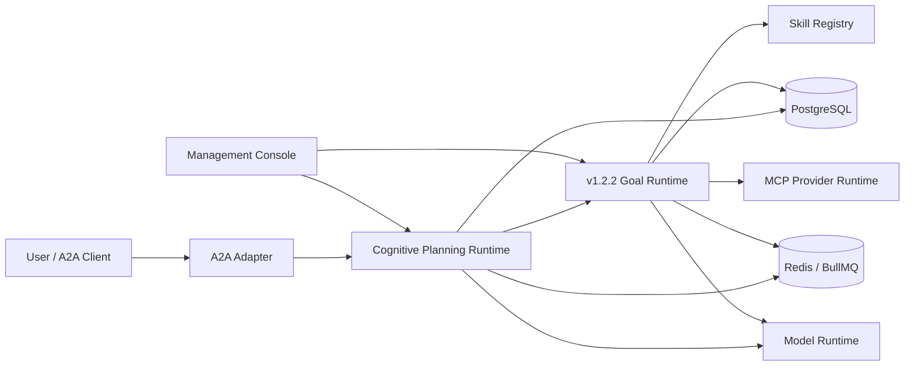
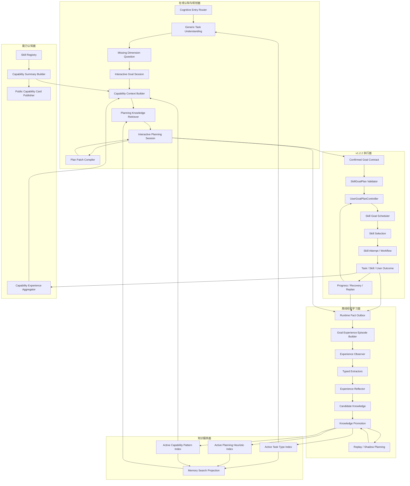
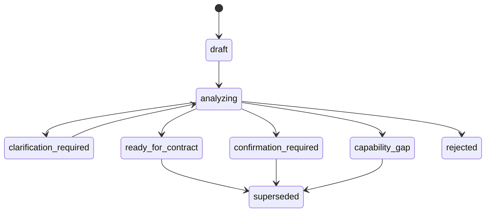
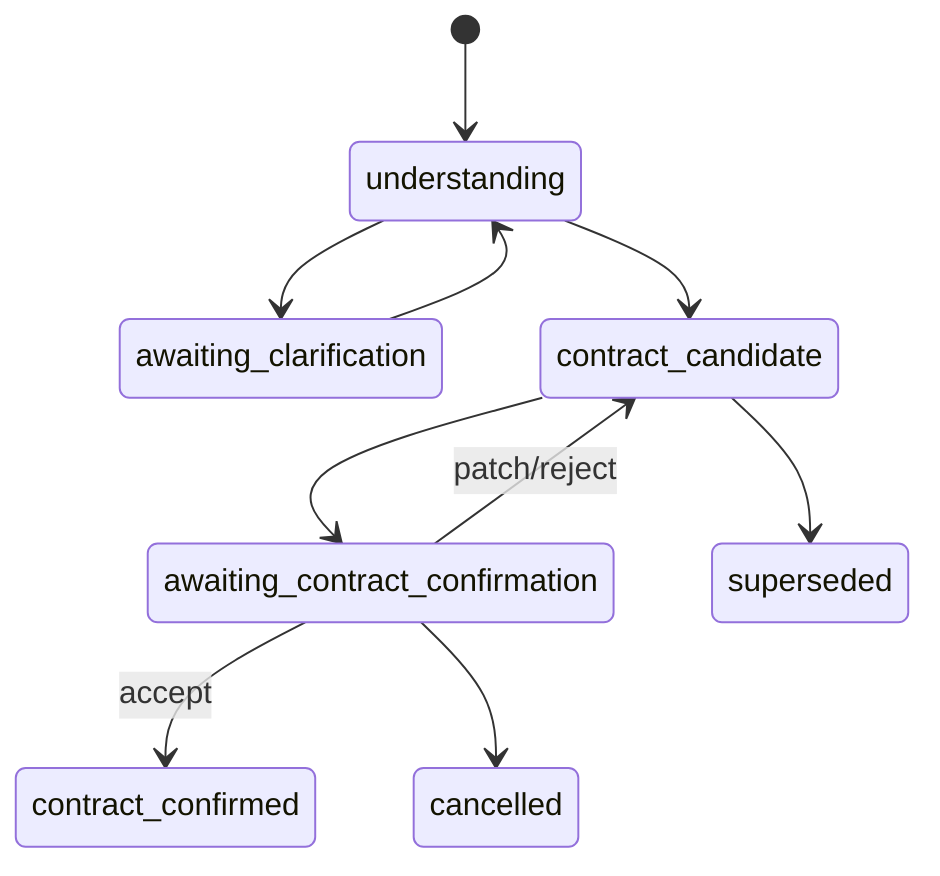
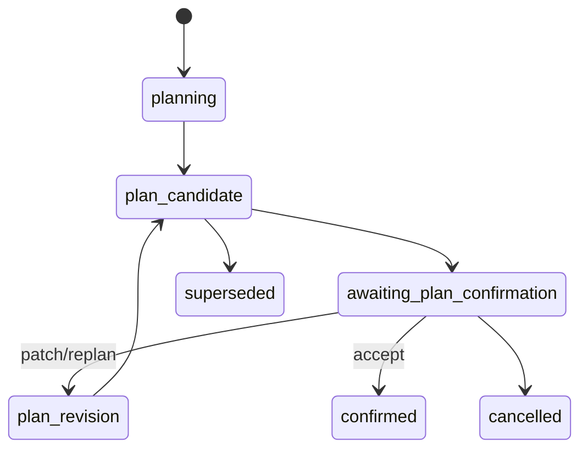
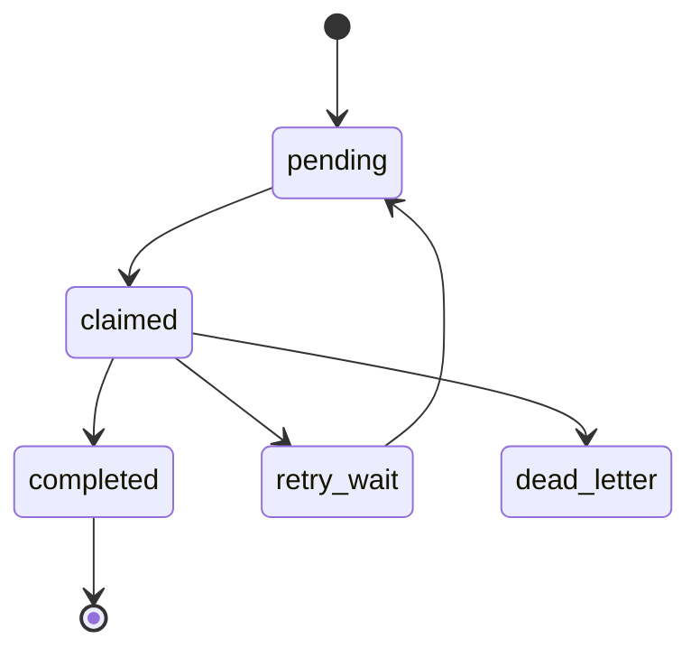
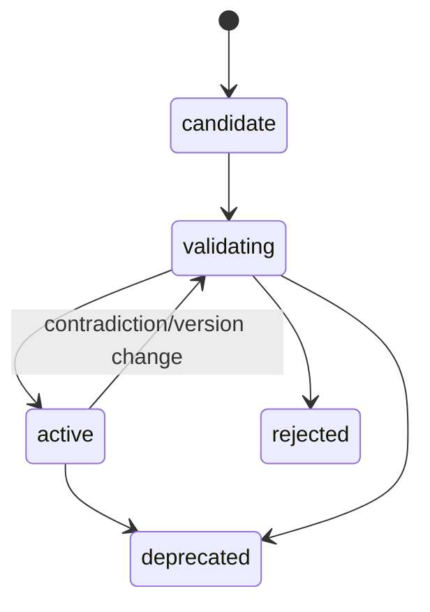

# SDAR v1.2.3 总体设计 V1.0

## 经验驱动的能力认知、泛型任务理解与人机协同规划运行时

> **文档状态：** Overall Design Candidate  
> **目标版本：** SDAR v1.2.3  
> **适用仓库：** `zhouwen-giser/skill-driven-agent-runtime`  
> **前置版本：** SDAR v1.2.2 User Goal Planning Runtime  
> **上位需求：** `SDAR_v1.2.3_Upgrade_Requirements_V0.1.md`  
> **实现依据：** `SDAR_v1.2.3_Best_Implementation_Design_V1.0.md`  
> **核心原则：** 增强认知与学习，不替换 v1.2.2 的 Goal、Skill、Outcome、Recovery 权威  
> **参考机制：**
> - Mastra：Observer、Reflector、Typed Extractor、异步经验压缩；
> - Claude Code：Plan Mode、多轮反馈、直接编辑计划、纠正记忆；
> - Codex：Goal Mode、Progressive Disclosure、Skills、Record & Replay、验证优先。
> **运行时约束：**
> - LangGraph.js 仍为唯一 Workflow Runtime；
> - PostgreSQL 仍为唯一持久化权威；
> - Redis/BullMQ 仍为可重建异步执行层；
> - SDAR Model Runtime 仍为唯一模型调用入口；
> - `UserGoalPlanController` 仍为 User Goal/A2A Terminal Authority。
> **冻结状态：** 本文尚未冻结；关键设计决策、Domain Skeleton、DDL Skeleton 和接口 Schema 评审通过后方可进入正式实现。

---

# 1. 一页结论

SDAR v1.2.3 在 v1.2.2 已有的目标规划和自主执行能力上，增加一个独立的：

```text
Cognitive Planning Runtime
```

它负责：

```text
理解用户在说什么
→ 判断还缺什么
→ 与用户共同确认目标
→ 总结系统具有什么能力
→ 生成并共同修订 Skill Goal Plan
→ 记录用户为什么修改计划
→ 从执行和修订中归纳经验
→ 形成候选任务类型、能力模式和规划经验
→ 经过验证和晋升后反哺后续任务
```

它不负责：

```text
直接执行设备动作
替代 Skill Selection
替代 Provider Readiness
替代 Outcome Judge
替代 Recovery
直接发布新 Skill
自动降低安全或完成标准
```

总体闭环：

```text
                    ┌───────────────────────────────┐
                    │     Cognitive Planning       │
                    │                               │
User Request ──────►│ Understand                    │
                    │ Clarify                       │
                    │ Confirm Goal                  │
                    │ Summarize Capability          │
                    │ Retrieve Experience           │
                    │ Generate Plan                 │
                    │ Human Review / Patch          │
                    └──────────────┬────────────────┘
                                   │ Confirmed Contract + Plan
                                   ▼
                    ┌───────────────────────────────┐
                    │       v1.2.2 Runtime          │
                    │                               │
                    │ Schedule Skill Goals          │
                    │ Select Skills                 │
                    │ Execute Workflow / MCP Task   │
                    │ Judge Task / Skill / Goal     │
                    │ Progress / Recovery / Replan  │
                    └──────────────┬────────────────┘
                                   │ Structured Runtime Facts
                                   ▼
                    ┌───────────────────────────────┐
                    │       Learning Runtime        │
                    │                               │
                    │ Build Episode                 │
                    │ Observe / Extract             │
                    │ Reflect                       │
                    │ Validate / Replay / Shadow    │
                    │ Promote                       │
                    └──────────────┬────────────────┘
                                   │ Active Knowledge
                                   └──────────────► Cognitive Planning
```

版本核心价值：

```text
v1.2.2 让 SDAR 能围绕目标持续执行
v1.2.3 让 SDAR 能理解目标、总结能力、与人共同规划并从结果中成长
```

---

# 2. 设计目标

## 2.1 业务目标

v1.2.3 应使 SDAR 能够：

1. 接收“完成区域检查”“处理一下异常”等不完整任务表达；
2. 判断目标对象、范围、完成标准、证据、副作用授权等关键信息是否缺失；
3. 用有限轮次的人机交互形成可确认的 User Goal Completion Contract；
4. 根据当前 Skill Catalog 形成稳定、结构化的 Runtime Capability Summary；
5. 将公开能力投影为动态 A2A Agent Card 和 Capability Profile；
6. 基于能力总结、任务类型和已验证经验生成 Skill Goal Plan；
7. 允许用户在执行前增删 Skill Goal、修改依赖、标准、优先级和并行关系；
8. 将用户每次修改保存为一等事实；
9. 从 v1.2.2 的 Contract、Plan、Attempt、Outcome、Progress、Recovery 和 Event Impact 中构建经验；
10. 从多次相似经验中归纳候选任务类型、能力模式和规划经验；
11. 通过反例、Replay、Shadow Planning 和人工门禁决定是否晋升；
12. 只将 Active Knowledge 注入后续任务理解和规划。

## 2.2 技术目标

- 不引入第二套 Workflow Runtime；
- 不引入第二套持久化权威；
- 不直接依赖 Mastra、Codex 或 Claude Code Runtime；
- 经验处理与在线执行解耦；
- 任务理解、目标合同和计划均版本化；
- 所有 Model 输出均经过结构化 Schema 和确定性校验；
- 经验增强失败时能够回退基础 v1.2.2 Planner；
- 能力总结对相同 Skill Catalog 具有确定性；
- 候选知识默认不可影响正式 Planner；
- 所有知识使用都可追踪到来源和最终结果。

---

# 3. 设计原则

## 3.1 v1.2.2 是执行基座

```text
v1.2.3 Cognitive Planning
→ 只提交 Confirmed Goal Contract / Plan Candidate

v1.2.2 Runtime
→ 负责 Plan Admission、Execution、Outcome、Recovery
```

v1.2.3 不复制：

- Skill Goal Scheduler；
- Skill Selection；
- Skill Attempt；
- Workflow Controller；
- Task/Skill/User Outcome Judge；
- UserGoalPlanController；
- Business Event Impact；
- No Replay。

## 3.2 经验是建议，不是权威

```text
Experience
→ Advisory Planning Input
```

经验不得：

- 改写用户确认的 Contract；
- 宣告当前能力可用；
- 绕过 Readiness；
- 绕过 Policy；
- 绕过 Plan Validator；
- 宣告 Goal achieved；
- 直接执行 Tool。

## 3.3 结构化事实优先

所有长期知识必须来自：

```text
Persisted Runtime Fact
→ Structured Episode
→ Structured Observation
→ Candidate Knowledge
→ Promotion
```

禁止：

```text
Raw Prompt / Chain of Thought
→ Long-term Knowledge
```

## 3.4 候选与生效分离

```text
Candidate Knowledge
≠ Active Knowledge
```

所有模型归纳结果初始为 Candidate。

## 3.5 用户修订是一等数据

不只保存最终 Plan，还必须保存：

```text
Before
User Instruction
Structured Patch
After
Validation Result
Accepted / Rejected
Final Outcome
```

## 3.6 公开能力与内部能力分离

```text
Internal Capability Summary
→ Public Visibility Filter
→ Public Capability Card
```

公开卡片不得泄露内部 Tool、Provider、Workflow、私有经验或实时资源状态。

## 3.7 渐进式披露

Planner 初始只获得：

- Task Type Index；
- Capability Index；
- Planning Heuristic Index。

只有被召回的 Top-K 项才加载完整定义。

## 3.8 非阻断学习

经验采集和学习失败不得影响：

- A2A 终态；
- Goal Planning；
- Skill Goal Scheduling；
- Recovery；
- 当前任务执行。

---

# 4. 设计范围与非范围

## 4.1 设计范围

- 能力总结与能力卡片；
- 泛型任务理解；
- 缺失维度识别；
- 多轮目标澄清；
- 交互式 Goal Contract 确认；
- 交互式 Skill Goal Plan 修订；
- 用户修订记录；
- Experience Episode；
- Observer/Extractor/Reflector；
- Task Type Induction；
- Capability Pattern Induction；
- Planning Heuristic；
- Knowledge Promotion；
- Replay/Shadow Evaluation；
- Active Knowledge Serving；
- Planner Experience Injection；
- Management API 和 Console；
- A2A input-required 与 Capability Profile。

## 4.2 非范围

- 基础模型训练或微调；
- 自动修改模型权重；
- 第二套 Agent/Workflow Runtime；
- 通用物理资源本体；
- Provider 内部调度；
- 自动发布高风险 Skill；
- 自动降低 Goal Completion 标准；
- 经验直接控制设备；
- 跨租户自由共享用户经验；
- 保存私有思维链；
- 将 Capability Summary 当作实时 Readiness；
- 将 Task Type 当作固定 Workflow Template；
- 对 v1.2.2 历史数据兼容。

---

# 5. 系统上下文



边界说明：

| 系统 | 权威 |
|---|---|
| 用户/A2A Client | 当前任务意图和确认 |
| v1.2.3 Cognitive Runtime | 理解、候选合同、交互计划、知识治理 |
| v1.2.2 Goal Runtime | Goal Plan Admission、执行、Outcome、Recovery |
| Skill Registry | 声明能力 |
| MCP Provider | 当前资源、任务状态和可用性 |
| PostgreSQL | 持久化事实和知识权威 |
| Redis/BullMQ | 异步任务调度，不是权威 |
| Model Runtime | 推理服务，不拥有业务状态 |

---

# 6. 总体逻辑架构



---

# 7. 架构分层

## 7.1 接入与交互层

职责：

- A2A Task/Message 接入；
- 识别当前交互 Session；
- 将内部 clarification/confirmation 映射为 A2A `input-required`；
- 接收用户回答和 Plan Action；
- 提供 Management API；
- 提供 Console。

组件：

```text
CognitiveTaskEndpointAdapter
A2AInteractionProjection
InteractiveActionRouter
CapabilityCardEndpoint
ManagementHttpEndpoint
```

## 7.2 认知规划应用层

职责：

- 决定是否进入泛型任务理解；
- 创建和推进 Interactive Goal Session；
- 创建和推进 Interactive Planning Session；
- 调用能力总结和知识检索；
- 生成候选 Contract/Plan；
- 执行 Patch 和版本切换；
- 将 Confirmed 对象交给 v1.2.2。

组件：

```text
CognitivePlanningCoordinator
GenericTaskUnderstandingService
MissingDimensionQuestionService
InteractiveGoalSessionService
InteractivePlanningSessionService
InteractivePlanPatchService
PlanningContextAssembler
```

## 7.3 能力认知应用层

职责：

- 从 Skill Registry 确定性生成能力总结；
- 聚合能力经验；
- 构建渐进式 Capability Index；
- 生成公开能力卡片；
- 管理 Catalog Hash 和重建。

组件：

```text
CapabilitySummaryBuilder
CapabilityIndexBuilder
CapabilityExperienceAggregator
PublicCapabilityProjectionPolicy
CapabilityNarrativeGenerator
CapabilityCardPublisher
```

## 7.4 经验学习应用层

职责：

- 从 v1.2.2 事实构建 Episode；
- 运行 Observer/Extractor/Reflector；
- 生成候选知识；
- 执行支持、反例、Replay 和 Shadow；
- 执行晋升与失效。

组件：

```text
GoalExperienceEpisodeBuilder
ExperienceObserverService
ExperienceExtractorPipeline
ExperienceReflectorService
TaskTypeInductionService
CapabilityPatternInductionService
PlanningHeuristicInductionService
KnowledgePromotionService
KnowledgeRevalidationService
```

## 7.5 知识服务层

职责：

- 只提供 Active Knowledge；
- Task Type/Capability/Heuristic 索引；
- Progressive Disclosure；
- 适用性过滤；
- 向量召回；
- 结构化重排；
- 使用记录。

组件：

```text
TaskTypeIndexService
CapabilityPatternIndexService
PlanningHeuristicIndexService
PlanningKnowledgeRetriever
KnowledgeApplicabilityEvaluator
ExperienceUsageRecorder
```

## 7.6 领域层

包含：

```text
GoalExperienceEpisode
ExperienceObservation
ExperienceReflection
KnowledgeCandidate
PlanningHeuristic
TaskTypeDefinition
CapabilityPatternDefinition
RuntimeCapabilitySummary
PublicCapabilityCardSnapshot
GenericTaskUnderstanding
InteractiveGoalSession
InteractivePlanningSession
PlanningCorrectionFact
PlanningInteractionEpisode
KnowledgePromotionEvaluation
```

## 7.7 基础设施层

- PostgreSQL Repository；
- Transactional Outbox；
- BullMQ Worker；
- Model Runtime Adapter；
- Embedding Adapter；
- JSON Schema Validator；
- A2A Projection；
- API/Console Projection；
- Metrics/Tracing。

---

# 8. 核心组件设计

## 8.1 CognitivePlanningCoordinator

统一在线入口。

```ts
interface CognitivePlanningCoordinator {
  handleNewRequest(input: {
    taskId: string;
    contextId: string;
    requestText: string;
    interactionPolicy: InteractionPolicy;
  }): Promise<CognitiveDisposition>;

  handleInteraction(input: {
    taskId: string;
    sessionId: string;
    expectedVersion: number;
    action: CognitiveInteractionAction;
  }): Promise<CognitiveDisposition>;
}
```

职责：

1. 读取是否已有 Active Session；
2. 判断请求是否可直接进入 v1.2.2 Contract；
3. 否则进入 Generic Task Understanding；
4. 推进 Goal Session；
5. 推进 Plan Session；
6. Confirmed 后调用 v1.2.2 Admission Port；
7. 不拥有执行终态。

## 8.2 CognitiveEntryRouter

输入分类：

```text
explicit_goal_ready
generic_task
goal_clarification_response
goal_contract_action
plan_action
runtime_goal_patch
status_query
cancel
```

规则优先：

- Metadata 中有 Session ID 时走 Session；
- 当前 Task 为 input-required 时先解析 Interaction；
- 当前有 Active Plan Review 时不创建新 Goal；
- 明确状态查询不触发新规划；
- 无法确定时进入 Model Classification；
- Model 只输出候选，Router 再校验当前状态。

## 8.3 GenericTaskUnderstandingService

流程：

```text
Request
→ Normalize
→ Retrieve Task Type Index
→ Retrieve Capability Index
→ Deterministic Missing Clues
→ Structured Model Understanding
→ Missing Dimension Policy
→ Persist Understanding Revision
```

输出：

```ts
interface GenericTaskUnderstanding {
  understandingId: string;
  revision: number;
  originalRequest: string;
  interpretedObjective: string;
  taskTypeCandidates: TaskTypeCandidate[];
  capabilityRequirements: CapabilityRequirement[];
  knownDimensions: TaskDimensionValue[];
  missingDimensions: MissingTaskDimension[];
  assumptions: PlanningAssumption[];
  confidence: number;
  disposition:
    | "ready_for_contract"
    | "clarification_required"
    | "confirmation_required"
    | "capability_gap";
  sourceHash: string;
  createdAt: string;
}
```

## 8.4 MissingDimensionQuestionService

优先级函数：

```text
score =
blockingWeight
× uncertaintyWeight
× planDivergenceWeight
× safetyWeight
× informationGain
```

规则：

- 每轮默认一个问题；
- 高度关联字段可合并；
- 问题必须绑定 Missing Dimension；
- 不能问已回答的问题；
- 高风险授权优先；
- 不允许无限追问；
- 用户明确拒绝回答时按 Policy 处理。

## 8.5 InteractiveGoalSessionService

状态：

```text
understanding
→ awaiting_clarification
→ contract_candidate
→ awaiting_contract_confirmation
→ contract_confirmed
→ superseded / cancelled
```

操作：

```text
answer_question
accept_contract
patch_contract
reject_contract
restart_understanding
cancel
```

所有 Candidate 不可变。

`patch_contract`：

```text
Natural Language Patch
→ Structured GoalContractPatch
→ Patch Validator
→ Candidate Revision
→ Contract Validator
```

## 8.6 InteractivePlanningSessionService

状态：

```text
planning
→ plan_candidate
→ awaiting_plan_confirmation
→ plan_revision
→ confirmed
→ superseded / cancelled
```

操作：

```text
accept_plan
reject_plan
request_replan
add_skill_goal
remove_skill_goal
patch_skill_goal
change_dependency
change_priority
change_parallelism
change_completion_criterion
change_confirmation_policy
```

每次操作：

1. 校验 `expectedVersion`；
2. 创建 Structured Patch；
3. 应用到当前 Candidate；
4. 完整运行 SkillGoalPlanValidator；
5. 创建新 Candidate Version；
6. 保存 Diff；
7. 更新 Session；
8. 返回新的可展示 Plan。

## 8.7 PlanningContextAssembler

组装：

```text
Confirmed User Goal Contract
Current World State
Runtime Capability Index
Selected Capability Details
Active Task Type
Active Planning Heuristics
Capability Experience
Previous Plan / Replan Trigger
Completed Effects / Forbidden Replay
```

限制：

- 只加载 Active Knowledge；
- Top-K 有界；
- 每个知识保留 Source Ref；
- Experience 与 Contract 冲突时剔除；
- Catalog Hash 必须匹配；
- Context Hash 必须保存。

## 8.8 ExperienceEnrichedUserGoalPlanningService

采用 Decorator：

```text
ExperienceEnrichedUserGoalPlanningService
→ Base UserGoalPlanningService
```

执行：

```text
Try Assemble Enriched Context
→ Base Planner with Experience
→ Plan Validator
→ if invalid:
     Base Planner without Experience
→ Persist Experience Usage
```

该组件不修改 Base Planner 权威。

---

# 9. 能力认知设计

## 9.1 能力信息分层

```text
Skill Capability Declaration
→ Runtime Capability Summary
→ Planning Capability Context
→ Public Capability Card
```

### Skill Capability Declaration

来源于精确 Skill Version：

- capabilities；
- SkillUsageSpecification；
- SkillOutcomeSpecification；
- visibility；
- composition；
- context requirements；
- evidence；
- effects；
- artifacts；
- policy。

### Runtime Capability Summary

内部确定性聚合。

### Planning Capability Context

Summary + Active Capability Experience。

### Public Capability Card

授权后的公开投影。

## 9.2 CapabilitySummaryBuilder

输入：

```ts
interface CapabilitySummaryBuildInput {
  skillVersions: readonly EnabledSkillVersion[];
  generationPolicyVersion: string;
}
```

生成步骤：

```text
Validate Exact Skill Versions
→ Sort by skillId/version
→ Normalize Capability Declarations
→ Group by Domain/Capability
→ Build Skill Ref Mapping
→ Build Effects/Evidence/Artifact Summary
→ Build Composition Patterns
→ Build Limitations
→ Canonicalize
→ Compute catalogHash
→ Persist Snapshot
```

不得调用 LLM。

## 9.3 Capability Index

```ts
interface CapabilityIndexEntry {
  capability: string;
  domain: string;
  shortDescription: string;
  effectSummary: string[];
  evidenceSummary: string[];
  limitationSummary: string[];
  detailRef: string;
  public: boolean;
}
```

初始 Planner Context 只放 Index。

## 9.4 Capability Detail

按需加载：

```ts
interface CapabilityDetail {
  capability: string;
  skillRefs: SkillVersionRef[];
  producibleEffects: string[];
  evidenceTypes: string[];
  artifactTypes: string[];
  requiredContext: ContextRequirement[];
  supportedModes: string[];
  taskTypes: string[];
  composition: CapabilityCompositionDetail[];
  policyLimitations: string[];
}
```

## 9.5 Capability Experience

并行存在，不写回声明：

```ts
interface CapabilityExperienceEvidence {
  capability: string;
  skillRefs: SkillVersionRef[];
  applicableConditions: string[];
  successfulGoalPatterns: string[];
  failurePatterns: string[];
  commonPrerequisites: string[];
  commonDependencies: string[];
  evidenceReliability: number;
  observedSuccessCount: number;
  observedFailureCount: number;
  confidence: number;
  sourceExperienceRefs: string[];
}
```

## 9.6 Public Capability Card

生成：

```text
Capability Summary Snapshot
→ Visibility Filter
→ Public Capability Profile
→ Deterministic Narrative Template
→ Optional LLM Narrative
→ Public Schema Validation
→ Card Snapshot
```

A2A Agent Card：

- 顶层 description 来自 Card Snapshot；
- `skills[]` 继续对应公开 Enabled Skill；
- 可增加 `io.sdar/capabilityProfile`；
- HTTP 请求只读取 Snapshot，不调用模型。

## 9.7 Card 一致性

Card 保存：

```text
catalogHash
generationPolicyVersion
cardContentHash
sourceSkillRefs
generatedAt
```

当 Skill Catalog 变化时：

```text
Skill Registry Outbox
→ Capability Rebuild Queue
→ Build Summary
→ Build Card
→ Atomic Activate Snapshot
```

旧 Summary 与新 Card 不允许混合。

---

# 10. 经验学习设计

## 10.1 经验事实来源

来自 v1.2.2：

```text
User Goal Contract
User Goal Plan Revisions
Skill Goals
Skill Attempts
Workflow Outcomes
Task/Skill/User Judgments
Progress Snapshots
Recovery Assessments
Business Event Impacts
Completed Effects
```

来自 v1.2.3：

```text
Task Understanding Revisions
Clarification Turns
Goal Contract Patches
Plan Patches
User Acceptance/Rejection
Planning Correction Facts
```

## 10.2 Transactional Outbox

所有事实提交事务内写：

```text
cognitive_runtime_outbox
```

事件至少包含：

```ts
interface CognitiveOutboxEvent {
  eventId: string;
  eventType: string;
  aggregateType: string;
  aggregateId: string;
  aggregateVersion: number;
  payloadRef: string;
  occurredAt: string;
  createdAt: string;
}
```

Consumer 以：

```text
eventId + handlerId
```

幂等。

## 10.3 GoalExperienceEpisodeBuilder

构建流程：

```text
Receive Trigger
→ Acquire Lease
→ Load Goal Contract
→ Load Plan Revision Chain
→ Load Skill Goals/Attempts
→ Load Outcomes/Progress/Recovery
→ Load Planning Interactions
→ Validate Authorities
→ Normalize Timeline
→ Redact
→ Compute Completeness
→ Compute Episode Hash
→ Persist Immutable Revision
→ Enqueue Observation
```

## 10.4 Episode 触发策略

### Terminal Episode

Goal Terminal 后创建完整 Episode。

### Revision Episode

重大 Plan Revision 后可创建增量 Episode。

### Interaction Episode

Goal/Plan Review 结束后创建交互经验。

### Recovery Episode

重大恢复和事件处置可创建专题 Episode。

第一版以 Terminal Episode 为主要晋升证据，其他 Episode 作为辅助。

## 10.5 ExperienceObserver

输入分区：

1. Contract；
2. Plan/Revisions；
3. Attempt Timeline；
4. Outcome/Progress；
5. Recovery/Event；
6. Human Corrections；
7. Previous Observation（有界）。

输出分类：

```text
fact
inference
candidate_lesson
uncertainty
contradiction
```

## 10.6 Typed Extractor Pipeline

```text
GoalPatternExtractor
TaskTypeSignalExtractor
DecompositionExtractor
DependencyExtractor
CriterionExtractor
EvidenceExtractor
ArtifactExtractor
CapabilityExtractor
FailureExtractor
RecoveryExtractor
NoProgressExtractor
HumanCorrectionExtractor
```

每个 Extractor：

- 独立 Schema；
- 独立状态；
- 独立错误；
- 失败不影响其他 Extractor；
- 结果保存 Source Episode；
- 不自动晋升。

## 10.7 ExperienceReflector

分组键：

```text
tenantId
goalPatternFingerprint
taskTypeCandidateId
capabilityFingerprint
timeWindow
```

Reflector 输出：

- Candidate Planning Heuristic；
- Candidate Task Type Revision；
- Candidate Capability Pattern Revision；
- Contradiction Finding；
- Supersede Suggestion。

## 10.8 触发与批次

建议：

```text
observerBatchMaxEpisodes = 8
reflectionTriggerObservationCount = 20
reflectionBatchMaxObservations = 100
```

实际值由 Capacity Test 冻结。

---

# 11. 知识模型

## 11.1 Planning Heuristic

类型：

```text
decomposition
dependency
criterion
evidence
artifact
risk
failure
recovery
no_progress
confirmation
```

内容：

- Statement；
- Applicability；
- Support/Contradiction；
- Risk；
- Source Episodes；
- Version；
- Status。

## 11.2 Task Type

描述：

- 如何识别；
- Negative Examples；
- 必填维度；
- 可选维度；
- 常见 Criteria；
- Capability Requirements；
- Skill Goal Patterns；
- Dependencies；
- Risks；
- 不适用条件。

Task Type 不绑定具体 Skill。

## 11.3 Capability Pattern

描述：

```text
某类任务在某些条件下通常需要某项能力
该能力需要什么前置
应该产生什么 Effect/Evidence/Artifact
哪些失败或限制常见
```

映射：

```text
Capability Pattern
→ 0..N Skill Version
```

无映射时生成 Capability Gap Candidate。

## 11.4 User Planning Preference

只保存低风险用户偏好：

- 展示方式；
- 报告格式；
- 是否偏好先看详细计划；
- 是否偏好串行/并行解释；
- 常用时间表达；
- 交互语言。

不得保存为默认：

- 设备操作授权；
- 安全豁免；
- 降低完成标准；
- 高风险自动确认。

---

# 12. Knowledge Promotion 设计

## 12.1 状态

```text
candidate
→ validating
→ active
→ deprecated / rejected
```

## 12.2 Promotion Pipeline

```text
Candidate Created
→ Deduplicate
→ Static Validation
→ Support/Contradiction Evaluation
→ Historical Replay
→ Shadow Planning
→ Risk Evaluation
→ Human Review（按策略）
→ Promote or Reject
```

## 12.3 通用 Promotion Framework

从现有 Skill Evolution 中抽取：

```text
EvidenceThresholdEvaluator
DuplicateCandidateDetector
ReplayEvaluationRunner
PromotionCaseRunner
CorrectionDiffRecorder
```

但 Target Adapter 不同：

```text
PlanningHeuristicPromotionTarget
TaskTypePromotionTarget
CapabilityPatternPromotionTarget
```

与：

```text
SkillPublicationTarget
```

严格分离。

## 12.4 支持与反例

```ts
interface PromotionEvidence {
  uniqueGoalCount: number;
  uniqueUserCount: number;
  successfulOutcomeCount: number;
  failedOutcomeCount: number;
  userAcceptedPlanningCount: number;
  userRejectedPlanningCount: number;
  replayPassedCount: number;
  replayFailedCount: number;
  shadowImprovedCount: number;
  shadowRegressedCount: number;
  supportingRefs: string[];
  contradictingRefs: string[];
}
```

## 12.5 初始晋升建议

### Planning Heuristic

- ≥3 个不同 Goal 支持；
- ≥2 个成功终态；
- 反例比例 ≤25%；
- Replay 通过；
- 风险不高于 medium。

### Task Type

- ≥5 个 Goal；
- ≥3 个不同用户请求表达；
- Required Dimensions 稳定；
- Criteria/Capability 结构稳定；
- Shadow Understanding 有改善；
- 人工批准。

### Capability Pattern

- ≥5 个 Goal；
- Effect/Evidence 一致；
- 至少一个当前 Skill 映射，或明确 Gap；
- 无安全冲突；
- 人工批准。

这些为初始实现参数，不是最终冻结值。

## 12.6 高风险知识

以下必须人工审核：

- 跳过确认；
- 设备副作用；
- 自动取消/暂停；
- 安全边界；
- 降级完成；
- 高风险恢复；
- 自动并行；
- 能力缺口转 Skill Proposal。

## 12.7 反例触发失效

```text
active
→ validating
```

触发：

- 新反例；
- Skill Version 变化；
- Capability Summary Catalog Hash 变化；
- Policy 变化；
- 用户拒绝率上升；
- Shadow Regression；
- 安全审查失败。

---

# 13. Replay 与 Shadow Planning

## 13.1 Replay 边界

只回放：

```text
Task Understanding
Missing Dimension Detection
Goal Contract Generation
Skill Goal Plan Generation
Plan Validation
Outcome Interpretation
```

不回放：

- 真实设备；
- MCP 副作用；
- Provider Resource State；
- Skill 发布；
- Candidate 激活。

## 13.2 Planning Replay Dataset

记录：

```text
request
conversation summary
world state summary
accepted contract
accepted plan
user patches
final outcome
capability catalog hash
knowledge context
```

## 13.3 Shadow Planning

```text
Baseline Planner
vs
Candidate Knowledge Enhanced Planner
```

比较：

- Missing Dimension Recall；
- Contract Acceptance；
- Criterion Coverage；
- Validator Pass；
- User Patch Count；
- Plan Size；
- Capability Gap；
- Attempt Count；
- Recovery Count；
- Final Outcome；
- Token/Latency；
- Risk。

## 13.4 Shadow 结果

Shadow 不影响正式 Task。

只保存：

```text
improved
neutral
regressed
invalid
unsafe
```

---

# 14. 在线交互设计

## 14.1 交互模式

```text
UNDERSTAND
GOAL_REVIEW
PLAN_REVIEW
EXECUTE
```

## 14.2 A2A 状态

| 内部状态 | A2A |
|---|---|
| Understanding | working |
| Awaiting clarification | input-required |
| Awaiting Goal Contract confirmation | input-required |
| Planning | working |
| Awaiting Plan confirmation | input-required |
| Executing | working |
| User Goal achieved | completed |
| User cancellation | canceled |
| Unachievable | failed |
| Capability Gap requiring choice | input-required 或 failed |

不新增 A2A 私有状态枚举。

## 14.3 A2A Interaction Metadata

```json
{
  "io.sdar/interaction": {
    "sessionId": "igs-123",
    "interactionType": "task_clarification",
    "questionId": "q-4",
    "expectedVersion": 3,
    "allowedActions": ["answer", "cancel"]
  }
}
```

## 14.4 Goal Contract Review

展示：

- Objective；
- Scope；
- Criteria；
- Evidence；
- Artifact；
- Guardrail；
- Assumption；
- Capability Gap；
- Risk；
- Source。

## 14.5 Plan Review

展示：

- Skill Goal DAG；
- Goal Objective；
- Criterion Coverage；
- Capability；
- Evidence/Artifact；
- Dependency；
- 并行关系；
- 风险；
- 用户确认点；
- Experience Hint。

## 14.6 Plan Patch

结构：

```ts
type UserGoalPlanPatch =
  | AddSkillGoalPatch
  | RemoveSkillGoalPatch
  | UpdateSkillGoalPatch
  | AddDependencyPatch
  | RemoveDependencyPatch
  | ChangeCriterionCoveragePatch
  | ChangePriorityPatch
  | ChangeParallelismPatch
  | ChangeConfirmationPolicyPatch;
```

Patch Model 只生成结构化 Patch，Application Service 再执行。

---

# 15. 状态机

## 15.1 Generic Task Understanding



## 15.2 Interactive Goal Session



## 15.3 Interactive Planning Session



## 15.4 Experience Job



## 15.5 Knowledge



---

# 16. 数据模型

## 16.1 Experience 表

```text
goal_experience_episode
goal_experience_episode_source
experience_observation
experience_observation_fact
experience_extraction
experience_reflection
experience_job
experience_dead_letter
```

### `goal_experience_episode`

关键字段：

```text
episode_id
goal_id
goal_version
agent_task_id
context_id
episode_type
revision
episode_hash
source_hash
completeness
terminal_outcome
status
tenant_id
user_scope_id
created_at
```

### `experience_observation`

```text
observation_id
episode_id / batch_id
model_invocation_id
factual_summary
uncertainty
content_hash
status
created_at
```

## 16.2 Knowledge 表

```text
planning_heuristic
planning_heuristic_evidence
task_type_definition
task_type_evidence
capability_pattern_definition
capability_pattern_evidence
knowledge_promotion_evaluation
knowledge_status_transition
experience_usage_record
```

## 16.3 Capability 表

```text
runtime_capability_summary
runtime_capability_summary_item
runtime_capability_limitation
capability_experience_evidence
public_capability_card_snapshot
```

## 16.4 Interactive Planning 表

```text
generic_task_understanding
generic_task_understanding_dimension
interactive_goal_session
interactive_goal_turn
goal_contract_candidate
interactive_planning_session
interactive_planning_turn
user_goal_plan_candidate
planning_correction_fact
planning_interaction_episode
```

## 16.5 Outbox

```text
cognitive_runtime_outbox
cognitive_runtime_consumer_cursor
```

## 16.6 主要唯一约束

```text
UNIQUE(goal_id, goal_version, episode_hash)
UNIQUE(source_event_id, handler_id)
UNIQUE(catalog_hash, generation_policy_version)
UNIQUE(task_id) WHERE interactive_goal_session active
UNIQUE(goal_id, goal_version) WHERE interactive_planning_session active
UNIQUE(knowledge_id, version)
UNIQUE(session_id, revision)
```

---

# 17. 一致性与并发

## 17.1 Session CAS

所有交互写入要求：

```text
sessionId
expectedVersion
idempotencyKey
```

冲突返回最新 Session Snapshot，不静默覆盖。

## 17.2 Goal Lock

Confirmed Contract/Plan 交接到 v1.2.2 时使用：

```text
goalId + goalVersion
```

锁内禁止：

- Model；
- MCP；
- Queue 网络调用。

## 17.3 Capability Snapshot

Summary 和 Card 通过：

```text
catalogHash
```

绑定。

激活新 Card 事务：

1. 校验 Summary；
2. 插入 Card Snapshot；
3. 更新 Active Card 指针；
4. 提交。

## 17.4 Knowledge Promotion

Promotion 使用：

```text
candidateId + expectedVersion
```

并保证一个 Candidate Version 只有一个终态 Promotion Evaluation。

## 17.5 Outbox

业务事实与 Outbox Event 同事务提交。

Worker 至少一次执行，Handler 幂等。

## 17.6 Planner Usage

ExperienceUsageRecord 在 Plan Candidate 持久化事务中保存，避免计划存在但无法解释使用了什么知识。

---

# 18. 异步处理与队列

队列：

```text
sdar-capability-summary
sdar-capability-card
sdar-experience-episode
sdar-experience-observer
sdar-experience-reflector
sdar-knowledge-promotion
sdar-shadow-planning
```

## 18.1 优先级

```text
Interactive Understanding
> Interactive Goal/Plan
> Capability Summary
> Episode Build
> Observer
> Reflector
> Promotion
> Shadow
```

交互请求不应通过低优先级 BullMQ 等待；在线理解使用 Application 调用，后台归纳使用 Queue。

## 18.2 Backpressure

- Episode Event 不丢失；
- Observer 可延迟；
- Reflection 可批量合并；
- Promotion 可限速；
- Shadow 可丢弃过期 Candidate；
- Capability Summary 只保留最新 Catalog；
- Card Job 只处理最新 Summary Hash。

## 18.3 Retry

```text
maxAttempts
exponentialBackoff
deadLetter
manualReplay
```

Model Schema 错误和基础设施错误分开统计。

---

# 19. Model Runtime

## 19.1 Stage

```text
task_understanding
task_clarification
goal_contract_generation
interactive_plan_patch
experience_observation
experience_reflection
task_type_induction
capability_pattern_induction
capability_narrative
knowledge_promotion_assessment
```

## 19.2 模型分级

### Fast Model

- 问题生成；
- 简单提取；
- Narrative；
- 小 Episode Observer。

### Reasoning Model

- 泛型任务理解；
- Contract；
- Plan Patch；
- Reflection；
- Task Type/Capability Induction；
- Promotion Assessment。

### Deterministic

- Hash；
- DAG；
- Coverage；
- Promotion Threshold；
- Visibility；
- Policy；
- Card Schema；
- State Machine；
- Outcome；
- Terminal。

## 19.3 统一结构化调用

所有模型请求包含：

```text
stage
operation
inputSchemaVersion
outputSchema
policyVersion
sourceRefs
correctionErrors
```

## 19.4 模型失败

在线：

- Understanding 失败：有界重试，无法恢复则 input-required/failed；
- Plan Patch 失败：保留当前 Candidate，要求重新表达；
- Narrative 失败：确定性模板。

离线：

- Observer/Reflector 失败：Retry/Dead Letter；
- 不生成默认 Candidate；
- 不影响当前任务。

---

# 20. 知识检索与上下文控制

## 20.1 检索流程

```text
Query Fingerprint
→ Vector Recall
→ Type/Scope Filter
→ Active Status Filter
→ Applicability Filter
→ Catalog/Policy Version Filter
→ Structured Rerank
→ Top-K Detail Load
```

## 20.2 MemoryService 复用

现有 MemoryService 保存 Active Knowledge 的搜索投影。

Projection 类型：

```text
planning_heuristic_projection
task_type_projection
capability_pattern_projection
user_planning_preference
```

Memory 不保存完整权威对象。

## 20.3 检索预算

初始建议：

```text
maxTaskTypeIndexItems = 32
maxCapabilityIndexItems = 64
maxHeuristicIndexItems = 32

maxFullTaskTypes = 3
maxFullCapabilities = 8
maxFullHeuristics = 8

maxPlanningKnowledgeChars = 20,000
```

## 20.4 冲突处理

经验冲突：

- 保留 contradiction；
- 不合并为单一事实；
- 低置信度不注入；
- 当前用户约束优先；
- 安全策略优先；
- 当前 Skill/Policy Version 不匹配时剔除。

---

# 21. API 设计

## 21.1 Capability

```text
GET  /api/v1/capabilities/summary
GET  /api/v1/capabilities/summary/{summaryId}
POST /api/v1/capabilities/rebuild

GET  /api/v1/capabilities/card
GET  /api/v1/capabilities/card/{cardId}
POST /api/v1/capabilities/card/rebuild
```

## 21.2 Understanding

```text
GET  /api/v1/tasks/{taskId}/understanding
GET  /api/v1/tasks/{taskId}/understanding/revisions
```

## 21.3 Goal Session

```text
GET  /api/v1/tasks/{taskId}/goal-session
POST /api/v1/tasks/{taskId}/goal-session/actions
```

Action：

```json
{
  "expectedVersion": 3,
  "idempotencyKey": "...",
  "action": {
    "kind": "answer_question",
    "questionId": "...",
    "content": "..."
  }
}
```

## 21.4 Planning Session

```text
GET  /api/v1/tasks/{taskId}/planning-session
POST /api/v1/tasks/{taskId}/planning-session/actions
GET  /api/v1/tasks/{taskId}/planning-interactions
```

## 21.5 Experience

```text
GET  /api/v1/experience/episodes
GET  /api/v1/experience/episodes/{id}
GET  /api/v1/experience/observations
GET  /api/v1/experience/reflections
GET  /api/v1/experience/dead-letters
POST /api/v1/experience/dead-letters/{id}/replay
```

## 21.6 Knowledge

```text
GET  /api/v1/knowledge/heuristics
GET  /api/v1/task-types
GET  /api/v1/capability-patterns

POST /api/v1/knowledge/{kind}/{id}/promote
POST /api/v1/knowledge/{kind}/{id}/reject
POST /api/v1/knowledge/{kind}/{id}/revalidate
POST /api/v1/knowledge/{kind}/{id}/deprecate
```

所有写操作要求鉴权、Actor、Reason、CAS、审计。

---

# 22. Console 总体设计

## 22.1 Task Understanding 页面

- 原始请求；
- Understanding Revision；
- Task Type Candidates；
- Missing Dimensions；
- Assumptions；
- Confidence；
- Clarification Timeline。

## 22.2 Goal Contract Review

- Objective；
- Scope；
- Criteria；
- Artifact/Evidence；
- Guardrails；
- Diff；
- Accept/Patch/Reject。

## 22.3 Plan Review

- DAG；
- Skill Goal Detail；
- Coverage；
- Capability；
- Experience Hints；
- Risk；
- Diff；
- Accept/Patch/Replan。

## 22.4 Experience Governance

- Episode Timeline；
- Observation；
- Extractor Results；
- Reflection；
- Candidate Knowledge；
- Support/Contradiction；
- Replay；
- Promotion。

## 22.5 Capability Cognition

- Capability Index；
- Declared/Observed/Validated；
- Skill Mapping；
- Limitations；
- Gap；
- Public Card Preview；
- Catalog Hash。

## 22.6 Task Type Governance

- Recognition；
- Negative Examples；
- Dimensions；
- Criteria；
- Capability Requirements；
- Goal Patterns；
- Evidence；
- Status Transition。

---

# 23. 安全与隐私

## 23.1 数据分类

```text
public
tenant_internal
user_scoped
restricted
```

## 23.2 禁止采集

- 私有思维链；
- 未脱敏凭据；
- 原始 Provider Header；
- 非必要 PII；
- 未授权跨租户数据；
- 未持久化临时 Prompt。

## 23.3 用户经验作用域

```text
task_scoped
user_scoped
tenant_scoped
global_candidate
```

跨作用域晋升需要策略和审核。

## 23.4 Prompt Injection

Runtime Fact、User Correction、External Evidence 进入 Observer/Planner 前必须：

- 保留 Source Kind；
- 包裹为数据；
- 禁止把其文本当系统指令；
- Schema 长度限制；
- 不加载可执行内容；
- 不将 Tool Result 中的指令提升为 Policy。

## 23.5 能力卡片隐私

Public Projection Allowlist，而不是 Denylist。

允许：

- Capability；
- Domain；
- Public Summary；
- Public Limitation；
- Input/Output Mode。

禁止：

- Provider；
- Tool；
- Credential；
- Workflow；
- 内部 Skill；
- 用户经验；
- 成功率；
- 实时资源；
- Prompt。

---

# 24. 可观测性

## 24.1 Trace

统一 Correlation：

```text
contextId
taskId
goalId
goalVersion
interactiveSessionId
understandingId
planCandidateId
episodeId
observationId
knowledgeCandidateId
modelInvocationId
```

## 24.2 Metrics

### Understanding

```text
task_understanding_total
task_understanding_latency
task_clarification_rounds
missing_dimension_detected
contract_acceptance_rate
```

### Planning

```text
plan_candidate_total
plan_revision_total
plan_validator_failure
plan_confirmation_rate
planning_knowledge_hit
experience_fallback_total
```

### Experience

```text
episode_build_lag
episode_completeness
observer_failure
extractor_failure
reflection_lag
dead_letter_total
```

### Knowledge

```text
candidate_created
candidate_promoted
candidate_rejected
contradiction_rate
shadow_improved
shadow_regressed
active_knowledge_usage
```

### Capability

```text
capability_summary_build
capability_catalog_hash_change
capability_card_build
capability_gap_candidate
```

## 24.3 Audit

所有人工操作保存：

- actor；
- reason；
- before/after；
- source IP/session；
- createdAt；
- expectedVersion；
- result。

---

# 25. 性能与容量

## 25.1 在线目标

初始设计目标：

```text
Capability Summary Cache Hit P95 ≤ 50ms
Experience Retrieval P95 ≤ 500ms
Task Understanding P95 ≤ 3s
Plan Patch P95 ≤ 5s
```

不含用户等待时间。

## 25.2 数据规模

需要支持：

- 单 Goal 16 个 Skill Goal；
- 单 Episode 1000 个结构化事实引用；
- 单 Task 最多 5 轮澄清；
- 单 Plan 最多 5 个 Candidate Revision；
- 单次检索 8 个完整 Heuristic；
- Reflection Batch 100 个 Observation；
- Active Task Type 初期 1000 级；
- Active Capability Pattern 初期 10000 级。

实际容量由 Phase 9 测试调整。

## 25.3 Retention

- Runtime Episode：按租户策略；
- Observation：可长期保留，但支持删除传播；
- Candidate：无支持且过期可清理；
- Active Knowledge：保留版本和状态迁移；
- Shadow Plan：短期保留；
- User-scoped Preference：支持用户删除。

---

# 26. 故障与降级

## 26.1 Experience Repository 故障

```text
基础 Planner 正常运行
experienceContext = undefined
记录 degraded metric
```

## 26.2 Capability Summary 不可用

若当前 Skill Catalog 有已激活 Summary：

- 使用匹配 Hash Snapshot。

若无：

- 通过 Skill Catalog 生成最小 Deterministic Index；
- 禁止依赖 Narrative；
- 不允许 Hash 不匹配。

## 26.3 Observer/Reflector 故障

- 当前任务不受影响；
- 重试；
- Dead Letter；
- 不生成 Candidate。

## 26.4 Model 不可用

- 当前已有明确 Contract 时可走 v1.2.2；
- 泛型任务无法理解时进入 input-required/failed；
- Narrative 使用模板；
- 后台经验延迟。

## 26.5 Redis 丢失

- PostgreSQL Job/Outbox 权威；
- Reconciler 重新入队；
- 不重复创建 Episode；
- Promotion 幂等。

## 26.6 重启

恢复：

- Active Goal Session；
- Active Planning Session；
- Pending Outbox；
- Experience Jobs；
- Promotion Jobs；
- Capability Rebuild；
- Shadow Evaluations。

---

# 27. Feature Flag

```text
SDAR_CAPABILITY_SUMMARY_ENABLED
SDAR_CAPABILITY_CARD_ENABLED

SDAR_GENERIC_TASK_UNDERSTANDING_ENABLED
SDAR_INTERACTIVE_GOAL_ENABLED
SDAR_INTERACTIVE_PLANNING_ENABLED

SDAR_EXPERIENCE_CAPTURE_ENABLED
SDAR_EXPERIENCE_OBSERVER_ENABLED
SDAR_EXPERIENCE_REFLECTION_ENABLED

SDAR_TASK_TYPE_INDUCTION_ENABLED
SDAR_CAPABILITY_INDUCTION_ENABLED
SDAR_KNOWLEDGE_PROMOTION_ENABLED

SDAR_EXPERIENCE_INJECTION_MODE
= off | shadow | advisory | active
```

默认建议：

```text
Capability Summary/Card = enabled
Generic Understanding = enabled for ambiguous tasks
Interactive Goal/Plan = manual policy
Experience Capture = enabled
Observer/Reflection = enabled
Induction = shadow
Promotion = manual
Injection = shadow
```

Feature Flag 只控制能力启用，不得绕过 Domain Invariant。

---

# 28. 灰度策略

## 28.1 Capture Only

- 只记录 Interaction 和 Episode；
- 不运行模型归纳。

## 28.2 Observe Only

- 运行 Observer/Extractor；
- 管理端可见；
- 不产生 Active Knowledge。

## 28.3 Candidate Knowledge

- Reflector 生成 Candidate；
- 只供评审。

## 28.4 Shadow Injection

- 后台生成经验增强 Plan；
- 不影响正式 Task。

## 28.5 Advisory

- 将经验建议显示给 Planner 和用户；
- 必须人工确认。

## 28.6 Active Low-risk

- 低风险 Active Knowledge 自动注入；
- 仍通过 Plan Validator；
- 高风险仍人工确认。

---

# 29. 实施架构阶段

## Phase 0：总体 Skeleton

交付：

- ADR；
- Domain；
- State Machines；
- Ports；
- Schema；
- DDL Skeleton；
- Feature Flags；
- Traceability；
- 无产品行为。

## Phase 1：能力总结和卡片

交付：

- CapabilitySummaryBuilder；
- Catalog Hash；
- Capability Index；
- Public Projection；
- A2A Agent Card；
- API/Console。

## Phase 2：泛型任务理解

交付：

- CognitiveEntryRouter；
- GenericTaskUnderstanding；
- Missing Dimension；
- 人工 Task Type Fixture；
- A2A input-required。

## Phase 3：交互式 Goal/Plan

交付：

- Goal Session；
- Planning Session；
- Patch Compiler；
- Diff；
- Confirmation Gate；
- Planning Correction Facts。

## Phase 4：经验采集

交付：

- Outbox；
- Episode Builder；
- Episode Repository；
- Redaction；
- Queue/Retry。

## Phase 5：Observer/Extractor

交付：

- Observer；
- Typed Extractors；
- Model Stage；
- Batch；
- Management View。

## Phase 6：Reflector/Candidate

交付：

- Reflector；
- Candidate Heuristic；
- Candidate Task Type；
- Candidate Capability Pattern；
- Contradiction。

## Phase 7：Promotion Framework

交付：

- Threshold；
- Dedup；
- Replay；
- Shadow；
- Human Review；
- Status Transition。

## Phase 8：Planner Injection

交付：

- Active Knowledge Projection；
- MemoryService Projection；
- Progressive Disclosure；
- Retriever；
- Planner Decorator；
- Fallback；
- Usage Record。

## Phase 9：Hardening

交付：

- 并发；
- 重启；
- Backpressure；
- Tenant Isolation；
- Security；
- Capacity；
- Full E2E；
- Release Report。

依赖：

```text
P0
├── P1 Capability
├── P2 Understanding
│   └── P3 Interactive Planning
└── P4 Experience Capture
    └── P5 Observer
        └── P6 Reflector
            └── P7 Promotion
                └── P8 Injection

P1 + P3 + P8
└── P9 Release
```

P1、P2、P4 可并行。

---

# 30. 关键设计决策

| ID | 决策 | 推荐 |
|---|---|---|
| KD-01 | 不引入 Mastra Runtime | 批准 |
| KD-02 | MemoryService 只作为 Active Knowledge Projection | 批准 |
| KD-03 | 用户修订为一等事实 | 批准 |
| KD-04 | 能力总结确定性生成 | 批准 |
| KD-05 | Narrative 不具有能力权威 | 批准 |
| KD-06 | Task Type/Capability/Heuristic 统一晋升框架 | 批准 |
| KD-07 | Candidate 默认不可用于正式 Planner | 批准 |
| KD-08 | 第一版 Promotion 人工为主 | 批准 |
| KD-09 | Replay 不调用物理副作用 | 批准 |
| KD-10 | Progressive Disclosure | 批准 |
| KD-11 | 经验 Planner 失败回退基础 Planner | 批准 |
| KD-12 | Capability Pattern 不是 Skill | 批准 |
| KD-13 | v1.2.3 不自动发布正式 Skill | 批准 |
| KD-14 | 高风险知识必须人工批准 | 批准 |
| KD-15 | Active Knowledge 变化通过版本和状态迁移 | 批准 |
| KD-16 | A2A Card 读取 Snapshot，不请求时生成 | 批准 |
| KD-17 | 交互 Session 使用 CAS | 批准 |
| KD-18 | 只将 Confirmed Contract/Plan 交给 v1.2.2 | 批准 |
| KD-19 | Outbox 是学习事实入口 | 批准 |
| KD-20 | 用户级经验不自动全局化 | 批准 |

---

# 31. 主要风险

| 风险 | 影响 | 应对 |
|---|---|---|
| 经验污染 Planner | 极高 | Candidate/Promotion/Shadow |
| Observation 被误当事实 | 高 | Fact/Inference 分类 |
| 一次修订全局化 | 极高 | Scope/Threshold/Human Gate |
| 能力总结虚构能力 | 极高 | Deterministic Builder |
| Task Type 过拟合 | 高 | 多维 Fingerprint + Negative Examples |
| Planner Context 过大 | 高 | Progressive Disclosure |
| 多轮交互过长 | 中 | 信息增益和预算 |
| Plan Patch 破坏 DAG | 高 | 全量 Validator |
| 学习阻断执行 | 极高 | Outbox + Async + Fail-open |
| 高风险知识自动启用 | 极高 | Mandatory Human Approval |
| Replay 产生副作用 | 极高 | No Physical Provider |
| Memory 和结构化知识双权威 | 极高 | Memory 只做 Projection |
| Skill Evolution 越权发布 | 极高 | Promotion Target 分离 |
| Catalog/Card 不一致 | 高 | catalogHash + Atomic Activation |
| 用户经验跨租户泄露 | 极高 | Scope/Tenant Isolation |
| 模型成本过高 | 高 | Batch/Tier/Budget |
| Candidate 爆炸 | 中 | Fingerprint/Dedup/Retention |
| 反例未触发失效 | 高 | Active→Validating |
| 经验成功率替代 Readiness | 极高 | Authority Guard |
| v1.2.2 反向依赖 | 高 | Port Boundary/Architecture Test |

---

# 32. 验收架构场景

## 32.1 能力

1. Enabled Skill 集合生成稳定 Catalog Hash；
2. Skill Enable/Disable 触发 Summary/Card；
3. Narrative 失败使用模板；
4. Card 不泄露 Tool/Provider；
5. Capability Experience 不修改 Skill 声明；
6. Summary 不声明实时设备可用。

## 32.2 Understanding

7. 模糊任务进入 Understanding；
8. 明确任务可直接形成 Contract；
9. 缺少目标对象时提问；
10. 高风险授权缺失时确认；
11. 不重复询问已回答问题；
12. 达到轮次预算停止。

## 32.3 Goal/Plan

13. Contract Patch 创建新版本；
14. Plan Patch 创建新版本；
15. 环依赖被拒绝；
16. Criterion Coverage 缺失被拒绝；
17. 未确认 Plan 不创建 Attempt；
18. Confirmed Plan 正常进入 v1.2.2。

## 32.4 Experience

19. Goal Terminal 后异步创建 Episode；
20. Episode 幂等；
21. Observer 失败不影响 Goal；
22. Extractor 独立失败；
23. Reflector 只生成 Candidate；
24. 不保存私有思维链。

## 32.5 Promotion

25. 单个 Episode 不自动晋升；
26. 支持与反例可追踪；
27. Replay 不产生物理副作用；
28. Shadow 不影响正式 Task；
29. 高风险 Candidate 必须人工批准；
30. 新反例使 Active 进入 validating。

## 32.6 Planner Injection

31. 无经验基础 Planner 正常；
32. Experience DB 故障回退；
33. 经验增强 Plan 无效时重试基础 Planner；
34. 只加载 Active Knowledge；
35. ExperienceUsageRecord 可关联最终 Outcome。

## 32.7 恢复与安全

36. Redis 清空后 Job 重建；
37. 重启恢复 Session；
38. 并发 Plan Action 通过 CAS；
39. 跨租户隔离；
40. A2A TCK 通过。

---

# 33. 发布门禁

v1.2.3 Release 必须满足：

- v1.2.2 Release Gate 已通过；
- Domain/Schema/DDL 冻结；
- Capability Summary 确定性；
- Public Card 隐私审计；
- Generic Understanding 验收；
- Goal/Plan 多轮交互验收；
- 未确认无副作用；
- Episode/Observer/Reflector 异步验收；
- Candidate/Active 分离；
- Promotion/Replay/Shadow 验收；
- Experience Fallback 验收；
- Memory Projection 无双权威；
- Tenant/User Scope 验收；
- Restart/Concurrency/Idempotency；
- Cost/Capacity/Backpressure；
- Management API/OpenAPI；
- Console；
- A2A MUST TCK；
- SBOM/License；
- Release Report 明确 Experience 为 Advisory。

---

# 34. Definition of Done

```text
系统能力认知：
- 能从 Skill Registry 生成稳定 Capability Summary
- 能生成可追溯 Public Capability Card
- 能区分声明、观察和验证能力

任务理解：
- 能识别泛型任务
- 能识别关键缺失维度
- 能有界地向用户澄清
- 能形成可确认 Goal Contract

人机协同规划：
- 能生成候选 Skill Goal DAG
- 用户能增删和修改计划
- 每次修改可版本化、可验证、可追踪
- 未确认不执行

经验：
- 能从 v1.2.2 结构化事实创建 Episode
- 能异步 Observe/Extract/Reflect
- 失败不影响基础 Runtime
- 不保存私有思维链

学习：
- 能生成候选 Planning Heuristic
- 能生成候选 Task Type
- 能生成候选 Capability Pattern
- 能保存支持、反例和适用性
- 能通过 Replay/Shadow/Human Promotion

反哺：
- 只注入 Active Knowledge
- 使用 Progressive Disclosure
- 经验失败回退基础 Planner
- 知识使用可关联用户接受和最终 Outcome

权威：
- 用户确认 Contract 是意图权威
- Skill Registry 是能力声明权威
- Provider Readiness 是当前可用性权威
- Outcome Judge 是完成权威
- UserGoalPlanController 是 A2A Terminal Authority
```

---

# 35. 最终架构定义

```text
SDAR v1.2.3
=
Cognitive Planning Runtime
+
Capability Cognition Runtime
+
Interactive Goal/Plan Runtime
+
Experience Observation Runtime
+
Governed Knowledge Promotion Runtime
```

融合关系：

```text
Mastra
→ 提供“如何观察、压缩和反思经验”的机制参考

Claude Code
→ 提供“如何以只读计划模式和用户多轮修订形成可执行计划”的机制参考

Codex
→ 提供“如何围绕 Goal 持续推进、渐进式加载能力、记录并回放工作方式”的机制参考

SDAR
→ 提供工业任务所需的 Contract、Evidence、Outcome、Recovery、Policy 和 Promotion 权威
```

最终运行闭环：

```text
用户提出任务
→ SDAR 理解并澄清
→ 用户确认目标
→ SDAR 总结能力并召回已验证经验
→ 生成 Skill Goal Plan
→ 用户审查和调整
→ v1.2.2 执行、判断和恢复
→ v1.2.3 归纳经验
→ 验证和晋升任务类型、能力模式和规划经验
→ 下一次任务理解和规划更加准确
```
